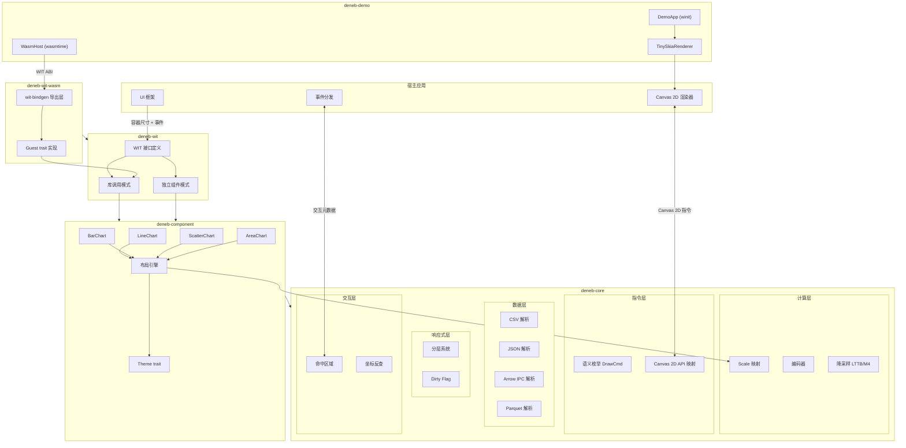
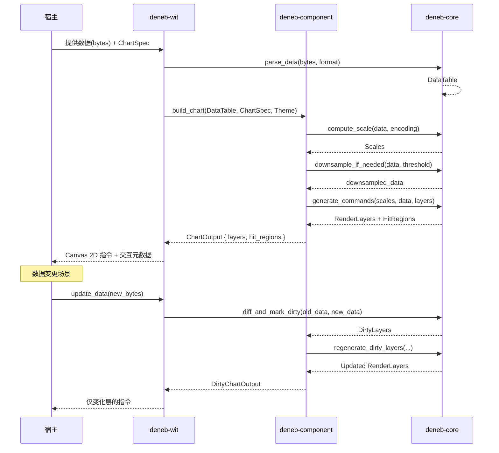
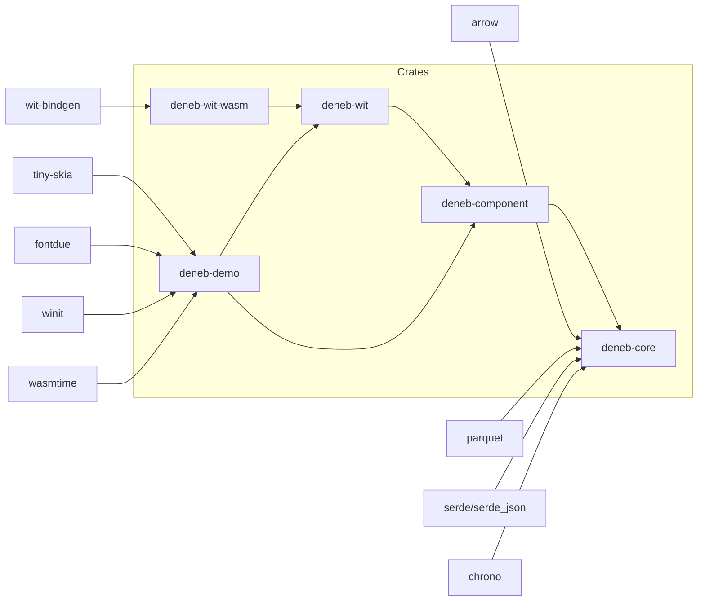

# deneb-viz Design

## 1. Architecture Overview



## 2. Key Type Definitions

### 2.1 deneb-core: Data Types

```rust
// 数据值
pub enum FieldValue {
    Numeric(f64),
    Text(String),
    Timestamp(f64),  // unix epoch seconds
    Bool(bool),
    Null,
}

// 数据行
pub type DataRow = Vec<FieldValue>;  // 列式存储中按索引对应列名

// 数据表（列式存储，适配 Arrow/Parquet）
pub struct DataTable {
    columns: Vec<Column>,
    schema: Schema,
}

pub struct Column {
    name: String,
    data_type: DataType,
    values: Vec<FieldValue>,
}

pub enum DataType {
    Quantitative,
    Temporal,
    Nominal,
    Ordinal,
}
```

### 2.2 deneb-core: Canvas 2D Instructions

```rust
// 语义枚举层 — 后端无关的绘制指令
pub enum DrawCmd {
    Rect {
        x: f64, y: f64, width: f64, height: f64,
        fill: Option<FillStyle>,
        stroke: Option<StrokeStyle>,
        corner_radius: Option<f64>,
    },
    Path {
        segments: Vec<PathSegment>,
        fill: Option<FillStyle>,
        stroke: Option<StrokeStyle>,
    },
    Circle {
        cx: f64, cy: f64, r: f64,
        fill: Option<FillStyle>,
        stroke: Option<StrokeStyle>,
    },
    Text {
        x: f64, y: f64,
        content: String,
        style: TextStyle,
        anchor: TextAnchor,
        baseline: TextBaseline,
    },
    Group {
        label: Option<String>,
        items: Vec<DrawCmd>,
    },
}

pub enum PathSegment {
    MoveTo(f64, f64),
    LineTo(f64, f64),
    BezierTo(f64, f64, f64, f64, f64, f64),
    QuadraticTo(f64, f64, f64, f64),
    Arc(f64, f64, f64, f64, f64, bool),
    Close,
}

// Canvas 2D API 映射层 — 贴近浏览器 API 的调用序列
pub enum CanvasOp {
    Save,
    Restore,
    SetFillStyle(String),
    SetStrokeStyle(String),
    SetLineWidth(f64),
    SetFont(String),
    SetTextAlign(String),
    SetTextBaseline(String),
    BeginPath,
    ClosePath,
    MoveTo(f64, f64),
    LineTo(f64, f64),
    BezierCurveTo(f64, f64, f64, f64, f64, f64),
    QuadraticCurveTo(f64, f64, f64, f64),
    Arc(f64, f64, f64, f64, f64, bool),
    Fill,
    Stroke,
    FillRect(f64, f64, f64, f64),
    StrokeRect(f64, f64, f64, f64),
    ClearRect(f64, f64, f64, f64),
    FillText(String, f64, f64),
    StrokeText(String, f64, f64),
}

// 双层输出
pub struct RenderOutput {
    pub semantic: Vec<DrawCmd>,      // 语义层 — 用于宿主理解和定制
    pub canvas_ops: Vec<CanvasOp>,   // Canvas 2D 层 — 用于直接执行
}
```

### 2.3 deneb-core: Layer System

```rust
#[derive(Debug, Clone, Copy, PartialEq, Eq, Hash)]
pub enum LayerKind {
    Background,
    Grid,
    Axis,
    Data,
    Legend,
    Title,
    Annotation,
}

pub struct Layer {
    pub kind: LayerKind,
    pub dirty: bool,
    pub commands: RenderOutput,
    pub z_index: u32,
}

pub struct RenderLayers {
    layers: Vec<Layer>,
}

impl RenderLayers {
    /// 获取需要重绘的层
    pub fn dirty_layers(&self) -> impl Iterator<Item = &Layer> { ... }
    /// 标记指定层为 dirty
    pub fn mark_dirty(&mut self, kind: LayerKind) { ... }
    /// 标记全部层为 dirty（数据变更时）
    pub fn mark_all_dirty(&mut self) { ... }
}
```

### 2.4 deneb-core: Interaction Metadata

```rust
pub struct HitRegion {
    pub index: usize,          // 数据点索引
    pub series: Option<usize>, // 系列索引（多系列时）
    pub bounds: BoundingBox,
    pub data: Vec<FieldValue>, // 对应的数据值
}

pub struct BoundingBox {
    pub x: f64, pub y: f64,
    pub width: f64, pub height: f64,
}

/// 坐标反查接口
pub trait CoordLookup {
    /// 像素坐标 → 最近的数据点索引
    fn hit_test(&self, x: f64, y: f64, tolerance: f64) -> Option<HitResult>;
    /// 像素坐标 → 数据空间值
    fn invert(&self, x: f64, y: f64) -> Option<(FieldValue, FieldValue)>;
}

pub struct HitResult {
    pub index: usize,
    pub series: Option<usize>,
    pub distance: f64,
    pub data: Vec<FieldValue>,
}
```

### 2.5 deneb-core: Scale System

```rust
pub type ScaleDomain = (f64, f64);
pub type ScaleRange = (f64, f64);

pub trait Scale: Clone {
    type Input: Clone;
    fn map(&self, input: Self::Input) -> f64;
    fn invert(&self, output: f64) -> Self::Input;
    fn domain(&self) -> ScaleDomain;
    fn range(&self) -> ScaleRange;
}

pub struct LinearScale { ... }    // 连续数值
pub struct OrdinalScale { ... }   // 离散类别
pub struct TimeScale { ... }      // 时间轴
pub struct LogScale { ... }       // 对数轴
pub struct BandScale { ... }      // 条形图类别轴
```

### 2.6 deneb-component: Chart Spec (Vega-Lite inspired)

```rust
// 声明式 Chart Spec — Builder 模式
let spec = ChartSpec::builder()
    .mark(Mark::Line)
    .encoding(Encoding::new()
        .x(Field::temporal("date"))
        .y(Field::quantitative("value"))
        .color(Field::nominal("category"))
    )
    .title("Sales Trend")
    .width(800.0)
    .height(400.0)
    .build()?;

// Mark 类型
pub enum Mark {
    Line,
    Bar,
    Scatter,  // Point mark
    Area,
}

// 字段编码
pub struct Field {
    pub name: String,
    pub data_type: DataType,
    pub aggregate: Option<Aggregate>,
    pub title: Option<String>,
}

// Field 构造器
impl Field {
    pub fn quantitative(name: impl Into<String>) -> Self;
    pub fn temporal(name: impl Into<String>) -> Self;
    pub fn nominal(name: impl Into<String>) -> Self;
    pub fn ordinal(name: impl Into<String>) -> Self;
    pub fn with_aggregate(self, agg: Aggregate) -> Self;
    pub fn with_title(self, title: impl Into<String>) -> Self;
}

pub enum Aggregate {
    Sum, Mean, Median, Min, Max, Count,
}

// 编码通道
pub struct Encoding {
    pub x: Option<Field>,
    pub y: Option<Field>,
    pub color: Option<Field>,
    pub size: Option<Field>,
}

// Encoding 构造器
impl Encoding {
    pub fn new() -> Self;
    pub fn x(self, field: Field) -> Self;
    pub fn y(self, field: Field) -> Self;
    pub fn color(self, field: Field) -> Self;
    pub fn size(self, field: Field) -> Self;
}
```

### 2.7 deneb-component: Theme Trait

```rust
pub trait Theme {
    // 颜色
    fn palette(&self, n: usize) -> Vec<String>;
    fn background_color(&self) -> String;
    fn foreground_color(&self) -> String;

    // 字体
    fn font_family(&self) -> &str;
    fn title_font_size(&self) -> f64;
    fn label_font_size(&self) -> f64;
    fn tick_font_size(&self) -> f64;

    // 线条
    fn grid_stroke(&self) -> StrokeStyle;
    fn axis_stroke(&self) -> StrokeStyle;
    fn default_stroke_width(&self) -> f64;

    // 间距
    fn padding(&self) -> Margin;
    fn tick_size(&self) -> f64;
}

pub struct Margin {
    pub top: f64, pub right: f64,
    pub bottom: f64, pub left: f64,
}

// 预置主题
pub struct DefaultTheme;
pub struct DarkTheme;
```

## 3. Data Flow



## 4. WIT Interface Design

### 4.1 WIT 定义（deneb-wit/wit/world.wit）

```wit
package deneb:viz;

interface data-parser {
    record schema-field {
        name: string,
        data-type: string,  // "quantitative" | "temporal" | "nominal" | "ordinal"
    }

    record data-table {
        columns: list<schema-field>,
        rows: list<list<field-value>>,
    }

    variant field-value {
        numeric(f64),
        text(string),
        timestamp(f64),
        boolean(bool),
        null,
    }

    parse-csv: func(data: list<u8>) -> result<data-table, string>;
    parse-json: func(data: list<u8>) -> result<data-table, string>;
    parse-arrow: func(data: list<u8>) -> result<data-table, string>;
    parse-parquet: func(data: list<u8>) -> result<data-table, string>;
}

interface chart-renderer {
    record chart-spec {
        mark: string,
        x-field: string,
        y-field: string,
        color-field: option<string>,
        width: f64,
        height: f64,
        title: option<string>,
        theme: option<string>,
    }

    record draw-cmd {
        cmd-type: string,
        params: list<f64>,
        fill: option<string>,
        stroke: option<string>,
        stroke-width: option<f64>,
        text-content: option<string>,
        group-depth: u32,
    }

    record hit-region {
        index: u32,
        series: option<u32>,
        bounds-x: f64,
        bounds-y: f64,
        bounds-w: f64,
        bounds-h: f64,
    }

    record layer {
        kind: string,
        dirty: bool,
        z-index: u32,
        commands: list<draw-cmd>,
        hit-regions: list<hit-region>,
    }

    record render-result {
        layers: list<layer>,
    }

    render: func(data: list<u8>, format: string, spec: chart-spec) -> result<render-result, string>;
    hit-test: func(render-data: render-result, x: f64, y: f64, tolerance: f64) -> option<u32>;
}

world deneb-viz {
    export data-parser;
    export chart-renderer;
}
```

### 4.2 类型编码策略

WIT 不支持递归类型和 Rust 复杂枚举，需要展平转换：

**DrawCmd 编码：**

| 内部类型 | `cmd_type` | `params` 格式 |
|---------|-----------|--------------|
| `Rect` | `"rect"` | `[x, y, width, height]` |
| `Circle` | `"circle"` | `[cx, cy, radius]` |
| `Path` | `"path"` | 路径段编码（类型前缀拼接） |
| `Text` | `"text"` | `[x, y, font_size, anchor, baseline]` |
| `Group` | 展平处理 | 子命令递归展平，`group_depth` 递增 |

**Path 段编码（params 数组中按类型前缀拼接）：**

| 前缀 | 段类型 | 参数数量 |
|------|--------|---------|
| `0` | MoveTo | x, y |
| `1` | LineTo | x, y |
| `2` | BezierTo | cp1x, cp1y, cp2x, cp2y, x, y |
| `3` | QuadraticTo | cpx, cpy, x, y |
| `4` | Arc | cx, cy, r, start, end, ccw |
| `5` | Close | — |

**Text 定位编码：**

| params 索引 | 含义 | 值映射 |
|------------|------|--------|
| `[2]` | font_size | 原始值 |
| `[3]` | anchor | 0=Start, 1=Middle, 2=End |
| `[4]` | baseline | 0=Top, 1=Middle, 2=Bottom, 3=Alphabetic |

**DataTable 转换：** 内部列式存储转换为 WIT 行式传输。

### 4.3 deneb-wit-wasm（WASI Component 导出层）

使用 `wit-bindgen 0.51` 从 WIT 生成 guest 绑定：

```rust
wit_bindgen::generate!({
    world: "deneb-viz",
    path: "../deneb-wit/wit",
});

struct DenebVizComponent;

impl DataParserGuest for DenebVizComponent { ... }
impl ChartRendererGuest for DenebVizComponent { ... }

export!(DenebVizComponent);
```

编译目标：`wasm32-wasip2`，crate-type = `cdylib`，仅启用 csv + json features。Release 输出约 498KB。

### 4.4 deneb-demo WASM Host（宿主端）

使用 `wasmtime 44` 的 `bindgen!` 宏从同一 WIT 文件生成 host 端绑定：

```rust
wasmtime::component::bindgen!({
    path: "../deneb-wit/wit",
    world: "deneb-viz",
});

pub struct WasmHost {
    engine: wasmtime::Engine,
    store: wasmtime::Store<WasiState>,
    bindings: DenebViz,  // 自动生成的绑定
}
```

通过 `bindings.deneb_viz_data_parser().call_parse_csv()` 和 `bindings.deneb_viz_chart_renderer().call_render()` 进行类型安全调用。

## 5. Key Decisions

| 决策 | 选择 | 理由 | 备选 |
|------|------|------|------|
| 指令格式 | 双层（语义枚举 + Canvas 2D API） | 语义层支持宿主理解和定制，Canvas 层支持直接执行 | 纯语义枚举（宿主翻译开销）、纯 Canvas API（丢失语义） |
| 数据存储 | 列式（Column-based） | 天然适配 Arrow/Parquet，向量化计算友好 | 行式（HashMap-based，如 lodviz-rs） |
| 响应式模型 | 分层 dirty flag | 粒度适中，宿主按需重绘，实现简单 | 增量指令 diff（实现复杂，调试难） |
| 交互模型 | 接口+元数据导出 | 平衡 core 复杂度和宿主工作量 | 纯命中区域导出（宿主工作量大）、内建状态机（core 过重） |
| 降采样策略 | core 内建 LTTB + M4 | 成熟算法，LTTB 保视觉特征，M4 极速 | 宿主自行降采样（一致性差） |
| API 风格 | Builder 模式 + 类型状态 | 编译期阻止无效配置（如缺少 encoding） | 纯声明式 JSON spec（运行时验证） |
| WASM 目标 | wasm32-unknown-unknown + wasm32-wasip2 | 浏览器嵌入 + WASI 独立运行 | 仅 wasm32-unknown-unknown |

## 6. Error Handling

```rust
// deneb-core 错误类型
pub enum CoreError {
    ParseError { source: String, format: DataFormat },
    InvalidEncoding { field: String, reason: String },
    ScaleError { reason: String },
    EmptyData,
}

// deneb-component 错误类型
pub enum ComponentError {
    Core(CoreError),           // 边界转换
    InvalidConfig { reason: String },
}

// deneb-wit 错误类型 — WIT 只能用 string
// 所有错误在 WIT 边界转为 String，保留错误分类前缀
// "[parse] invalid CSV header" / "[encoding] missing x field" / "[scale] ..."
```

## 7. Dependencies (deneb-core)

```toml
[dependencies]
arrow = { version = "54", default-features = false, features = ["ipc"] }
parquet = { version = "54", default-features = false, features = ["arrow"] }
serde = { version = "1", features = ["derive"] }
serde_json = "1"
chrono = { version = "0.4", default-features = false }

[features]
default = ["csv", "json", "arrow-format", "parquet-format"]
csv = []
json = []
arrow-format = ["arrow"]
parquet-format = ["parquet", "arrow-format"]
```

## 8. Non-functional Targets

| 维度 | 目标 |
|------|------|
| 指令生成延迟 | 10K 点 < 5ms (WASM), 100K 点 < 50ms (WASM) |
| 内存占用 | 数据解析峰值不超过原始数据 2x |
| WASM 包体积 | deneb-core < 500KB (gzip, 含 Arrow/Parquet) |
| 编译目标 | wasm32-unknown-unknown, wasm32-wasip2, native |
| 并发安全 | 所有公开 API Send + Sync，内部无全局状态 |

## 9. Module Dependencies


