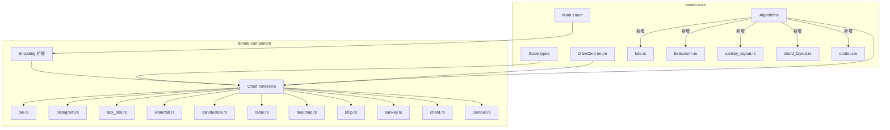

# More Chart Types Design

## 架构概览



## 关键设计决策

| 决策 | 选择 | 理由 |
|------|------|------|
| Encoding 扩展方式 | 在现有 Encoding 加可选通道 | 统一 API，与 ChartSpec builder 兼容 |
| Pie 弧形渲染 | DrawCmd::Arc + PathSegment::Arc | CanvasOp 已有 Arc，DrawCmd 层补齐 |
| 算法来源 | 移植 lodviz-rs 算法到 deneb-core | 逻辑已验证，适配 Canvas 指令即可 |
| Heatmap 颜色 | FillStyle::Gradient（线性渐变） | 比逐 cell 着色更高效，视觉一致 |
| 每个 chart 独立文件 | 一个 Mark = 一个 .rs 文件 | 与现有 line.rs/bar.rs 模式一致 |

## Encoding 扩展

```rust
pub struct Encoding {
    pub x: Option<Field>,
    pub y: Option<Field>,
    pub color: Option<Field>,
    pub size: Option<Field>,
    // 新增通道
    pub open: Option<Field>,    // Candlestick
    pub high: Option<Field>,    // Candlestick
    pub low: Option<Field>,     // Candlestick
    pub close: Option<Field>,   // Candlestick
    pub theta: Option<Field>,   // Pie (可选，不设则等分)
    pub color2: Option<Field>,  // 渐变终点色
}
```

## DrawCmd 扩展

```rust
pub enum DrawCmd {
    Rect { ... },
    Path { ... },
    Circle { ... },
    Text { ... },
    Group { ... },
    // 新增
    Arc {
        cx: f64, cy: f64, r: f64,
        start_angle: f64, end_angle: f64,
        fill: Option<FillStyle>,
        stroke: Option<StrokeStyle>,
    },
}
```

## Mark 枚举扩展

```rust
pub enum Mark {
    Line, Bar, Scatter, Area,
    // 新增
    Pie, Histogram, BoxPlot, Waterfall,
    Candlestick, Radar, Heatmap, Strip,
    Sankey, Chord, Contour,
}
```

## 各图表渲染设计

### 1. PieChart
- **Encoding**: theta (可选，默认等分) + color (分类)
- **Scale**: 无轴 Scale，角度从 0 到 2π 累积
- **DrawCmd**: Arc + Path (扇形) + Text (标签)
- **HitRegion**: 每个扇形一个 BoundingBox
- **特殊**: 支持内半径 → 环形图（donut）

### 2. Histogram
- **Encoding**: x (quantitative) + y (自动 count) + color (分组)
- **Scale**: x → LinearScale 分 bin, y → LinearScale（从 0 开始）
- **DrawCmd**: Rect（每个 bin 一个柱子）
- **算法**: 等宽 binning（Sturges 规则）
- **Y 轴必须从 0 开始**（柱状图变体）

### 3. BoxPlot
- **Encoding**: x (nominal/分组) + y (quantitative)
- **Scale**: x → BandScale, y → LinearScale
- **DrawCmd**: Rect (IQR box) + Path (whisker + median line) + Circle (outliers)
- **算法**: 五数概括（min, Q1, median, Q3, max）+ IQR * 1.5 异常值检测

### 4. Waterfall
- **Encoding**: x (nominal) + y (quantitative，增减值)
- **Scale**: x → BandScale, y → LinearScale（从 0 开始）
- **DrawCmd**: Rect（正绿负红）+ Text (标签)
- **特殊**: 累计基线计算，总柱标记
- **Y 轴必须从 0 开始**

### 5. Candlestick
- **Encoding**: x (temporal/nominal) + open/high/low/close (quantitative)
- **Scale**: x → BandScale, y → LinearScale
- **DrawCmd**: Rect (body: open-close) + Path (wick: high-low)
- **特殊**: 涨（收盘>开盘）绿/跌红

### 6. Radar
- **Encoding**: x (维度名，nominal) + y (quantitative) + color (分组)
- **Scale**: y → LinearScale 径向映射，x → 等角分配
- **DrawCmd**: Path (多边形轮廓 + 填充) + Text (维度标签) + Path (网格线)
- **特殊**: 极坐标系布局

### 7. Heatmap
- **Encoding**: x (nominal/quantitative) + y (nominal/quantitative) + color (quantitative → 颜色映射)
- **Scale**: x → BandScale 或 LinearScale, y → 同, color → LinearScale → 颜色梯度
- **DrawCmd**: Rect (每个 cell) 填充按颜色映射
- **特殊**: 颜色图例（color bar）

### 8. StripChart
- **Encoding**: x (nominal) + y (quantitative) + color (分组)
- **Scale**: x → BandScale, y → LinearScale
- **DrawCmd**: Circle (每个数据点)
- **算法**: beeswarm 布局避免重叠
- **特殊**: 抖动（jitter）模式备选

### 9. SankeyChart
- **Encoding**: x (source) + y (target) + color (分类) + size (流量)
- **Scale**: 节点位置由布局算法确定
- **DrawCmd**: Path (Bézier 曲线 ribbon) + Rect (节点) + Text (标签)
- **算法**: 移植 sankey_layout（层级分配 + Bézier 插值）

### 10. ChordChart
- **Encoding**: x (源分类) + y (目标分类) + color (分类) + size (流量)
- **Scale**: 角度由邻接矩阵确定
- **DrawCmd**: Arc (外圈弧段) + Path (Bézier ribbon) + Text (标签)
- **算法**: 移植 chord_layout（矩阵 → 角度分配 + ribbon 路径）

### 11. ContourChart
- **Encoding**: x (quantitative) + y (quantitative) + color (quantitative → 颜色映射)
- **Scale**: x/y → LinearScale
- **DrawCmd**: Path (等高线路径) + 填充
- **算法**: 移植 marching squares

## deneb-core 新增算法文件

| 文件 | 来源 | 功能 |
|------|------|------|
| `algorithm/kde.rs` | lodviz_core | 核密度估计（BoxPlot violin 变体用） |
| `algorithm/beeswarm.rs` | lodviz_core | 蜂群布局（StripChart 用） |
| `algorithm/sankey_layout.rs` | lodviz_core | Sankey 节点/连线布局 |
| `algorithm/chord_layout.rs` | lodviz_core | Chord 矩阵布局 |
| `algorithm/contour.rs` | lodviz_core | Marching squares 等高线 |

## WIT 接口变更
- `WitMark` 枚举新增 11 个变体（与 Mark 一一对应）
- `WitEncoding` 新增 open/high/low/close/theta 字段
- wit/chart-renderer.wit 文件更新

## 集成点
- **deneb-wit**: WitMark/WitEncoding 转换更新
- **deneb-wit-wasm**: WIT 文件更新，wit-bindgen 重新生成
- **deneb-demo**: 每种图表新增 demo binary（或合并到通用 demo）
- **deneb-core**: DrawCmd::Arc + algorithm 模块扩展
