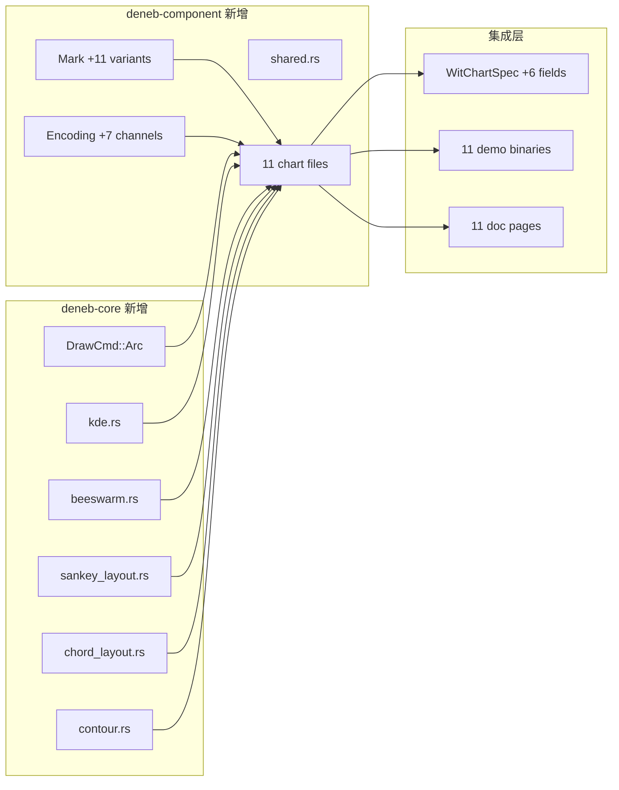

# More Chart Types — Feature Summary

## Goal
在 deneb-rs 中实现 11 种新图表类型，参考 lodviz-rs 算法，适配 Canvas 2D 指令架构。

## Result
✅ 全部完成。15 种图表类型（4 原有 + 11 新增），373 测试通过，0 clippy error。

## Metrics

| 维度 | 数值 |
|------|------|
| 新增图表类型 | 11 |
| Mark 枚举变体 | 4 → 15 |
| Encoding 通道 | 3 → 10 (x, y, color, size, open, high, low, close, theta, color2) |
| DrawCmd 新变体 | 1 (Arc) |
| 算法文件移植 | 5 (kde, beeswarm, sankey_layout, chord_layout, contour) |
| Demo binaries | 4 → 15 |
| 测试数 | 248 → 373 (+125) |
| 文档页 | 7 → 18 (+11 新图表页) |
| 新增代码行 | ~9000 |
| 重复代码消除 | ~500 行 (shared.rs 提取 + bar.rs 重构) |

## Implementation Waves

| Wave | 内容 | Agents | 耗时 |
|------|------|--------|------|
| Wave 1 | Mark/Encoding/DrawCmd 扩展 + 5 算法移植 | 4 deep | ~5min |
| Wave 2 | 11 图表渲染器实现 | 4 deep | ~8min |
| Wave 3 | WIT + Demo + 测试集成 | 1 deep | ~10min |
| Wave 4 | Review (2 agent) + Compliance fix (3 agent) | 5 | ~15min |
| Wave 5 | Docs update (3 writing agent) | 3 | ~15min |

## Architecture Changes

## Key Design Decisions

| 决策 | 选择 | 理由 |
|------|------|------|
| Encoding 扩展 | 在现有 struct 加可选通道 | 统一 API，builder 兼容 |
| Pie 弧形渲染 | DrawCmd::Arc | CanvasOp 已有 Arc，DrawCmd 层补齐 |
| 算法来源 | 移植 lodviz-rs | 逻辑已验证，适配 Canvas 指令即可 |
| 共享渲染辅助 | chart/shared.rs | 消除 15 个图表文件间重复代码 |
| Y 轴 include_zero | matches!(Bar, Histogram, Waterfall) | CLAUDE.md 规范，长度编码数值的图表必须从 0 开始 |

## Compliance Review

| 维度 | 结果 | 详情 |
|------|------|------|
| P0 Functional | ✅ PASS | contour demo color 编码修复 |
| P1 Architecture | ✅ PASS | include_zero 扩展 + shared.rs 重构 + pie validate_data + pie/radar title |
| P2 Code Quality | ✅ PASS | chord unused vars + SliceData dead field + sankey comment + line/scatter/area validate_data |
| Tests | ✅ 373/373 | 174 core + 174 component + 20 wit + 5 doc |
| Clippy | ✅ 0 errors | 17 pre-existing warnings (contour_chart.rs style) |

## Edge Cases Verified

| 图表 | 边缘情况 | 处理方式 |
|------|---------|---------|
| Pie | 空数据 | 空指令，不 panic |
| Histogram | 所有值相同 | 单 bin |
| BoxPlot | < 5 数据点 | percentile 正常处理 |
| Waterfall | 全正/全负 | 基线正确 |
| Candlestick | OHLC 缺失 | InvalidConfig 错误 |
| Strip | 单类别 | 单列布局 |
| Heatmap | 单 cell | 正常渲染 |
| Radar | < 2 维度 | 空渲染 |
| Sankey | 零流量 | 跳过 ribbon，保留节点 |
| Chord | 空矩阵 | 空指令 |
| Contour | < 3 点 | 散点降级 |

## Date
2026-05-07
