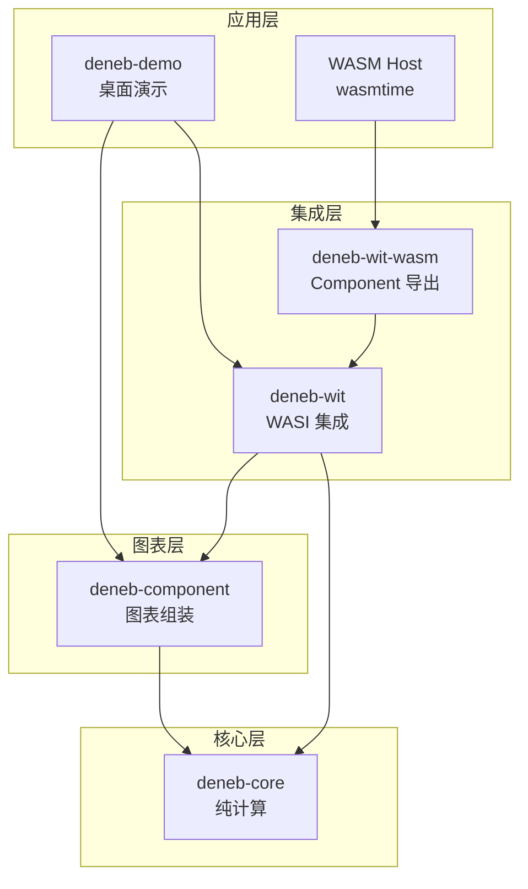
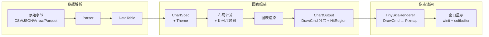
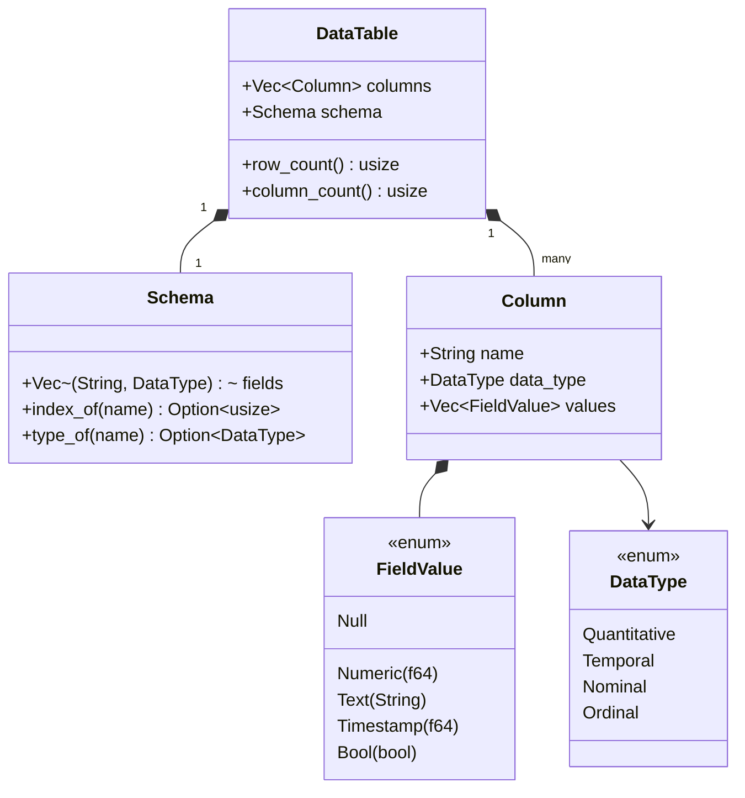
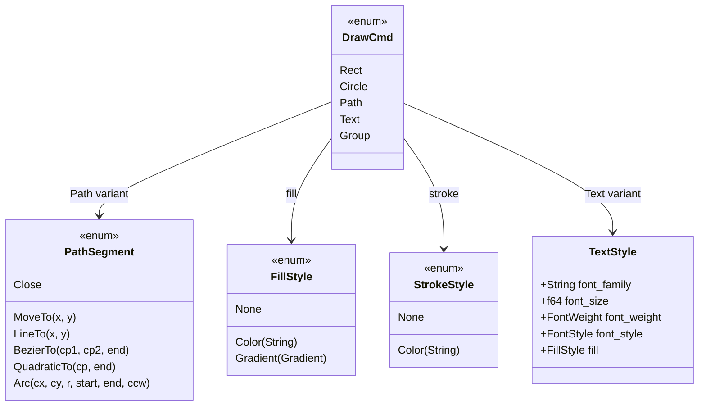
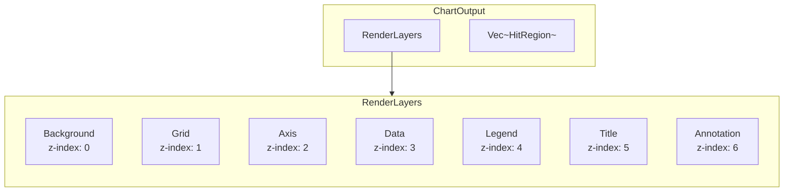
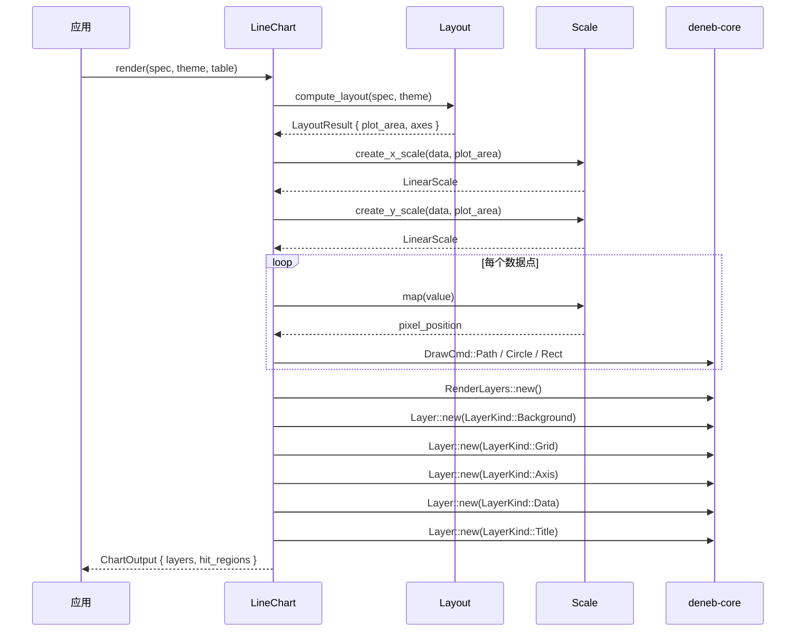
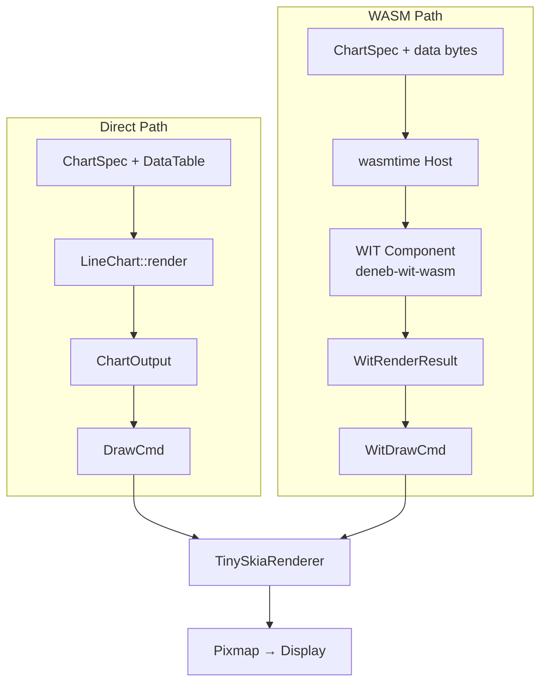
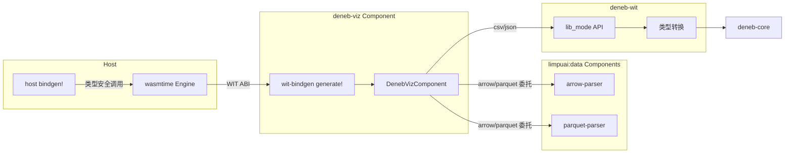
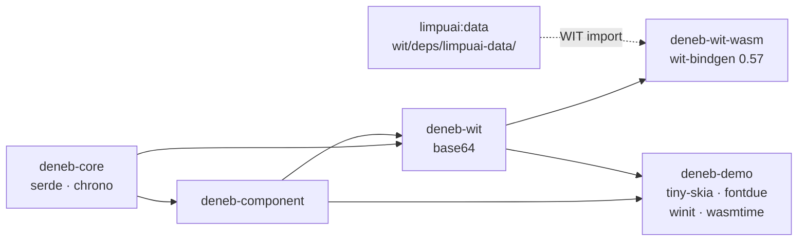

# 架构设计

## 分层总览

deneb-rs 采用四层架构，每层职责明确、单向依赖：

## Crate 职责

| Crate | 职责 | 关键导出 |
|-------|------|---------|
| **deneb-core** | 数据类型、绘图指令、比例尺、解析器 | `DataTable`, `DrawCmd`, `Scale`, `RenderLayers` |
| **deneb-component** | 图表类型实现、布局、主题 | `LineChart`, `BarChart`, `ChartSpec`, `Theme` |
| **deneb-wit** | WASI 集成层，类型转换 | `WitDrawCmd`, `WitRenderResult`, `lib_mode` |
| **deneb-wit-wasm** | WASI Component Model 导出 | WIT 接口实现 |
| **deneb-demo** | 桌面演示 + WASM Host | `TinySkiaRenderer`, `WasmHost`, `DemoApp` |

## 渲染管线

从原始数据到像素的完整数据流：

## 核心数据类型

### 数据层

### 绘图指令

### 分层渲染

每层独立渲染，支持脏标记（dirty flag）的增量更新。

## 图表组装流程

以折线图为例，展示 `ChartSpec + DataTable → ChartOutput` 的完整过程：

## WASI Component Model

### 双路径架构

deneb-rs 支持两种渲染路径：

### WIT 接口

**导出接口：**

| 接口 | 函数 | 说明 |
|------|------|------|
| `data-parser` | `parse-csv` | 解析 CSV 数据 |
| `data-parser` | `parse-json` | 解析 JSON 数据 |
| `data-parser` | `parse-arrow` | 解析 Arrow IPC（委托 limpuai:data/arrow-parser） |
| `data-parser` | `parse-parquet` | 解析 Parquet（委托 limpuai:data/parquet-parser） |
| `chart-renderer` | `render` | 渲染图表 |
| `chart-renderer` | `hit-test` | 命中测试 |

### 类型转换策略

WIT 不支持递归类型和 Rust 复杂枚举，需要展平转换：

| 内部类型 | WIT 类型 | 转换策略 |
|---------|---------|---------|
| `DrawCmd`（枚举） | `WitDrawCmd`（扁平 record） | `cmd_type` 字符串 + `params` 数组 |
| `DrawCmd::Group`（递归） | `group_depth: u32` | 递归展平为线性列表 |
| `PathSegment`（枚举） | `params: list<f64>` | 类型编码前缀：0=MoveTo, 1=LineTo, ... |
| `TextAnchor` / `TextBaseline` | `params` 中的数字编码 | 0/1/2/3 映射 |
| `DataTable`（列式） | `WitDataTable`（行式） | 行列转置 |
| `FillStyle`（枚举） | `fill: option<string>` | 仅保留 Color 变体 |

## 依赖关系

| 外部依赖 | 用途 | 所在 Crate |
|---------|------|-----------|
| `serde` / `serde_json` | 序列化 | core, wit |
| `chrono` | 时间戳处理 | core |
| `arrow` / `parquet` | 二进制数据格式（可选） | core |
| `tiny-skia` | CPU 2D 渲染 | demo |
| `fontdue` | 文本栅格化 | demo |
| `winit` + `softbuffer` | 窗口管理 | demo |
| `wasmtime` | WASM 运行时 | demo |
| `wit-bindgen` 0.57 | WIT 绑定生成 | wit-wasm |

## 设计决策

| 决策 | 选择 | 理由 |
|------|------|------|
| 渲染输出 | Canvas 2D 指令序列 | 后端无关，可对接任意渲染器 |
| 数据模型 | 列式存储（内部）+ 行式（WIT） | 列式利于分析计算，行式利于跨语言传输 |
| WASM 模式 | WASI Component Model | 标准化组件模型，类型安全 |
| WIT 类型 | 展平 record | WIT 不支持递归类型 |
| 主题系统 | Trait 抽象 | 可扩展（DefaultTheme、DarkTheme） |
| 图层系统 | 7 层固定 + 自定义 | 脏标记支持增量渲染 |
