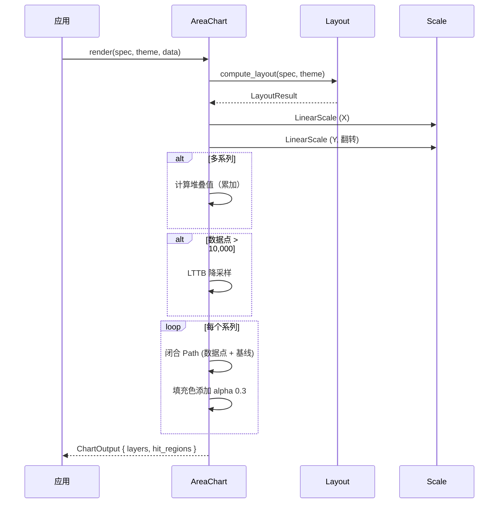

# 面积图 AreaChart

在折线下方填充区域，展示趋势和量级。

## 基本用法

```rust
use deneb_component::{AreaChart, ChartSpec, Encoding, Field, Mark, DefaultTheme};
use deneb_core::parser::csv::parse_csv;

let table = parse_csv("x,y\n0,20\n1,35\n2,28\n3,45\n4,38\n5,55")?;

let spec = ChartSpec::builder()
    .mark(Mark::Area)
    .encoding(Encoding::new()
        .x(Field::quantitative("x"))
        .y(Field::quantitative("y")))
    .width(800.0)
    .height(600.0)
    .build()?;

let output = AreaChart::render(&spec, &DefaultTheme, &table)?;
```

## 渲染流程



## 生成的绘图指令

| 指令 | 说明 |
|------|------|
| `Path` (Data 层) | 闭合面积路径：MoveTo → LineTo → 基线 → Close |
| `Path` (Grid 层) | 网格线 |
| `Path` (Axis 层) | 坐标轴线 |
| `Text` (Axis 层) | 刻度标签、轴标题 |
| `Text` (Title 层) | 图表标题 |
| `Rect` (Background 层) | 背景填充 |

## 路径构造

面积图的路径是闭合的，包含数据线和基线回程：

```
      ┌───────────────── 基线 (y=0)
      │    ╱╲
      │  ╱    ╲
      │╱        ╲
      └───────────────
      ↑ MoveTo       ↑ Close
```

构造顺序：
1. MoveTo 到第一个数据点
2. LineTo 连接后续数据点
3. LineTo 到最后一个点的基线位置
4. LineTo 回到第一个点的基线位置
5. Close 闭合

## 堆叠面积

多系列时自动堆叠，每个系列的 Y 值累加在前一个系列之上：

```rust
let spec = ChartSpec::builder()
    .mark(Mark::Area)
    .encoding(Encoding::new()
        .x(Field::quantitative("x"))
        .y(Field::quantitative("y"))
        .color(Field::nominal("series")))
    .build()?;
```

```
  ┌────────────────── Series C (累加)
  │  ┌────────────── Series B
  │  │  ┌────────── Series A (原始值)
  │  │  │
  └──┴──┴────────── 基线
```

堆叠计算：每行的 Y 值 = 当前系列原始值 + 前面所有系列的累加值。

## Alpha 混合

所有面积填充色自动添加 0.3 透明度（`rgba(r, g, b, 0.30)`），描边保持完全不透明。这使堆叠时各层都可辨识。

## 比例尺

- **X 轴**：`LinearScale`（Quantitative）或 `TimeScale`（Temporal）
- **Y 轴**：`LinearScale`，翻转（范围基于原始数据，非堆叠后）

## 特殊行为

| 场景 | 行为 |
|------|------|
| 单数据点 | 退化为 `Rect` 指令 |
| 空数据 | 仅返回 Background 层 |
| 数据点 > 10,000 | 自动 LTTB 降采样 |
| 多系列 | 自动堆叠 + alpha 混合 |

## 命中区域

每个数据点生成一个矩形 `HitRegion`，从数据点到基线的矩形区域（x±2px，y 到基线）。
