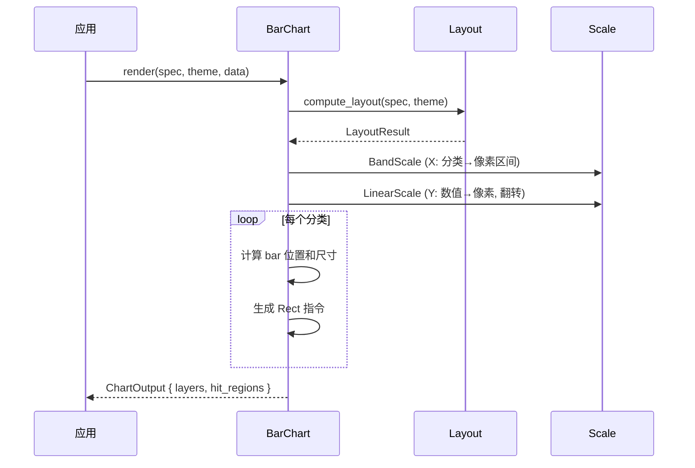

# 柱状图 BarChart

用矩形条高度表示分类数据的数值大小。

## 基本用法

```rust
use deneb_component::{BarChart, ChartSpec, Encoding, Field, Mark, DefaultTheme};
use deneb_core::parser::csv::parse_csv;

let table = parse_csv("category,value\nA,30\nB,55\nC,42\nD,68\nE,35")?;

let spec = ChartSpec::builder()
    .mark(Mark::Bar)
    .encoding(Encoding::new()
        .x(Field::nominal("category"))
        .y(Field::quantitative("value")))
    .width(800.0)
    .height(600.0)
    .build()?;

let output = BarChart::render(&spec, &DefaultTheme, &table)?;
```

## 渲染流程



## 生成的绘图指令

| 指令 | 说明 |
|------|------|
| `Rect` (Data 层) | 柱子矩形，每条数据一个 |
| `Path` (Grid 层) | 水平网格线 |
| `Path` (Axis 层) | 坐标轴线 + 刻度标记 |
| `Text` (Axis 层) | 分类标签（X）、数值标签（Y）、轴标题 |
| `Text` (Title 层) | 图表标题 |
| `Rect` (Background 层) | 背景填充 + 绘图区边框 |

## 多系列分组柱状图

```rust
let spec = ChartSpec::builder()
    .mark(Mark::Bar)
    .encoding(Encoding::new()
        .x(Field::nominal("category"))
        .y(Field::quantitative("value"))
        .color(Field::nominal("group")))
    .build()?;
```

多系列时，每个分类的 band 区间被子划分：

```
┌────────────────────────────────────────┐
│  ┌──┐┌──┐  ┌──┐┌──┐  ┌──┐┌──┐       │
│  │A1││A2│  │B1││B2│  │C1││C2│       │
│  │  ││  │  │  ││  │  │  ││  │       │
│  └──┘└──┘  └──┘└──┘  └──┘└──┘       │
│  Cat A      Cat B      Cat C         │
└────────────────────────────────────────┘
```

- Band 宽度按系列数等分
- 每个系列在 band 内按偏移量定位
- 各系列颜色不同

## 比例尺

- **X 轴**：`BandScale`，分类数据映射到等宽区间，padding = 0.1
- **Y 轴**：`LinearScale`，范围包含 0 点，翻转

## 特殊行为

| 场景 | 行为 |
|------|------|
| 负数值 | 基线（y=0）以上向上绘制，基线以下向下绘制 |
| 零值 | 最小 1px 高度保证可见 |
| 空数据 | 仅返回 Background + Title 层 |
| 缺少必需字段 | 返回 `ComponentError` |

## 命中区域

每个柱子生成一个矩形 `HitRegion`，精确匹配柱子的像素范围（x, y, width, height）。
