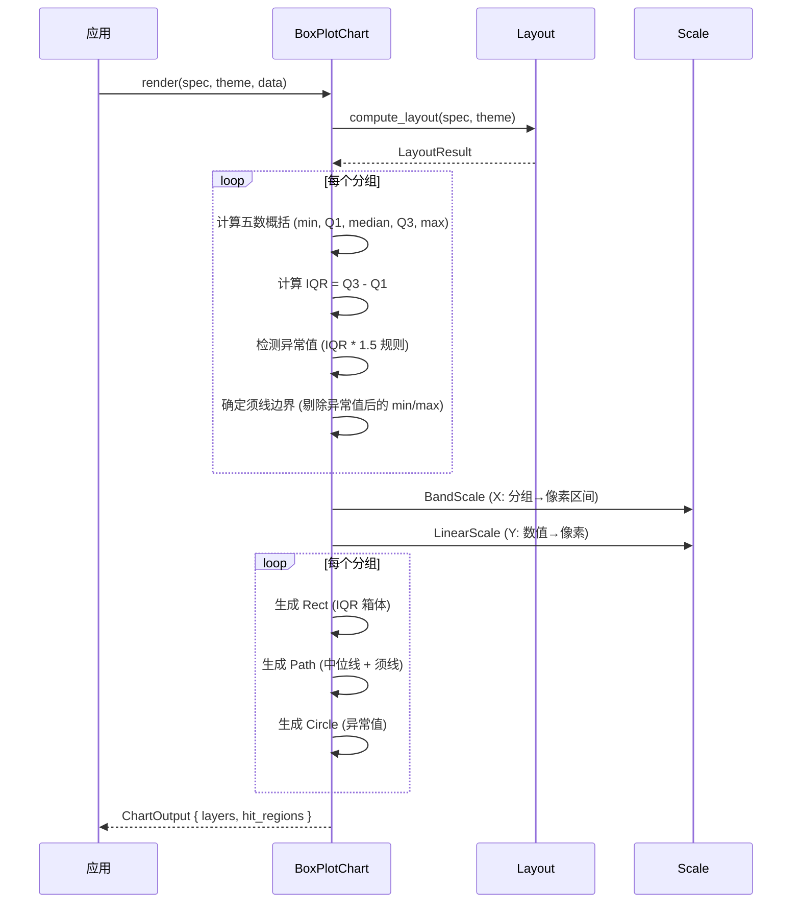

# 箱线图 BoxPlotChart

用箱体和须线表示数据的分布特征和异常值。

## 基本用法

```rust
use deneb_component::{BoxPlotChart, ChartSpec, Encoding, Field, Mark, DefaultTheme};
use deneb_core::parser::csv::parse_csv;

let table = parse_csv("group,value\nA,23\nA,45\nA,67\nA,34\nB,56\nB,78\nB,45\nB,67\nB,89\nB,34\nB,56\nB,78")?;

let spec = ChartSpec::builder()
    .mark(Mark::BoxPlot)
    .encoding(Encoding::new()
        .x(Field::nominal("group"))
        .y(Field::quantitative("value")))
    .width(800.0)
    .height(600.0)
    .build()?;

let output = BoxPlotChart::render(&spec, &DefaultTheme, &table)?;
```

## 渲染流程



## 生成的绘图指令

| 指令 | 说明 |
|------|------|
| `Rect` (Data 层) | IQR 箱体，从 Q1 到 Q3 |
| `Path` (Data 层) | 中位线（箱体内部）、须线（从箱体到边界） |
| `Circle` (Data 层) | 异常值点 |
| `Path` (Grid 层) | 水平网格线 |
| `Path` (Axis 层) | 坐标轴线 + 刻度标记 |
| `Text` (Axis 层) | 分组标签（X）、数值标签（Y）、轴标题 |
| `Text` (Title 层) | 图表标题 |
| `Rect` (Background 层) | 背景填充 + 绘图区边框 |

## 五数概括

每个分组计算五个统计量：

```
┌──────────────────────┐
│        max (whisker)  │ ← 上须线端点（剔除异常值后）
│                       │
│       ┌───────┐      │ ← Q3 (上四分位数)
│       │       │      │
│       │ median│      │ ← 中位数
│       │       │      │
│       └───────┘      │ ← Q1 (下四分位数)
│                       │
│        min (whisker)  │ ← 下须线端点（剔除异常值后）
└──────────────────────┘
```

**异常值检测**：
- 下界 = Q1 - 1.5 × IQR
- 上界 = Q3 + 1.5 × IQR
- 超出边界的点用圆圈标记

## 比例尺

- **X 轴**：`BandScale`，分组映射到等宽区间
- **Y 轴**：`LinearScale`，数值映射到像素

## 特殊行为

| 场景 | 行为 |
|------|------|
| 少于 5 个点 | 百分位数计算仍正常工作（Q1=25%, Q3=75%） |
| 所有值相同 | 箱体和须线重叠成一条线 |
| 空分组 | 跳过该分组 |
| 无异常值 | 须线延伸到数据的最小/最大值 |
| 空数据 | 仅返回 Background + Title 层 |
| 缺少必需字段 | 返回 `ComponentError` |

## 命中区域

每个箱线图生成多个 `HitRegion`：
- 箱体区域：IQR 箱体的矩形范围
- 异常值区域：每个异常值点的圆形区域
