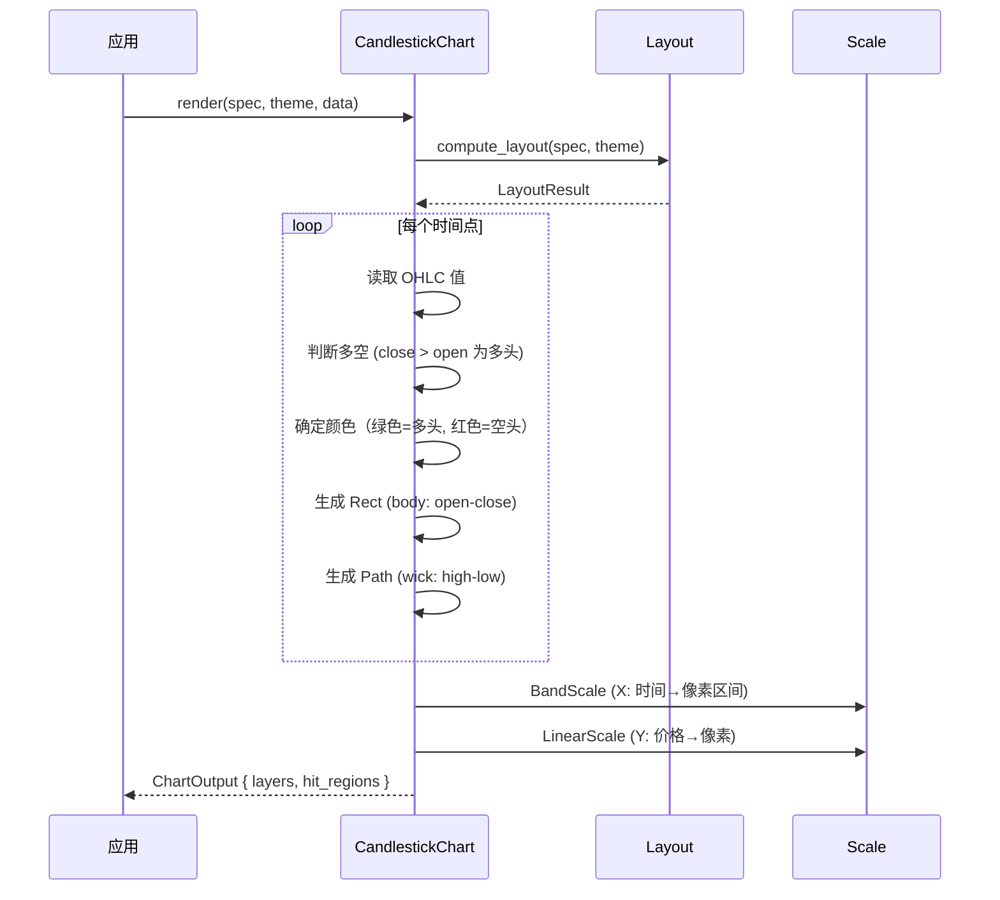

# K 线图 CandlestickChart

用蜡烛图表示开高低收（OHLC）价格变化，常用于金融数据分析。

## 基本用法

```rust
use deneb_component::{CandlestickChart, ChartSpec, Encoding, Field, Mark, DefaultTheme};
use deneb_core::parser::csv::parse_csv;

let table = parse_csv("date,open,high,low,close\n2024-01-01,100,110,95,105\n2024-01-02,105,115,102,112\n2024-01-03,112,120,108,115")?;

let spec = ChartSpec::builder()
    .mark(Mark::Candlestick)
    .encoding(Encoding::new()
        .x(Field::nominal("date"))
        .y(Field::quantitative("close"))
        .open(Field::quantitative("open"))
        .high(Field::quantitative("high"))
        .low(Field::quantitative("low"))
        .close(Field::quantitative("close")))
    .width(800.0)
    .height(600.0)
    .build()?;

let output = CandlestickChart::render(&spec, &DefaultTheme, &table)?;
```

## 渲染流程



## 生成的绘图指令

| 指令 | 说明 |
|------|------|
| `Rect` (Data 层) | 实体（body），从 open 到 close |
| `Path` (Data 层) | 影线（wick），从 high 到 low |
| `Path` (Grid 层) | 水平网格线 |
| `Path` (Axis 层) | 坐标轴线 + 刻度标记 |
| `Text` (Axis 层) | 时间标签（X）、价格标签（Y）、轴标题 |
| `Text` (Title 层) | 图表标题 |
| `Rect` (Background 层) | 背景填充 + 绘图区边框 |

## K 线结构

每根 K 线包含实体和影线两部分：

```
        High
         │
         │  ╱╲
         │ ╱  ╲
    ┌────┼────┐  ← 影线（wick）
    │    │    │
    │    │    │
    │    │    │
    └────┼────┘  ← 实体（body）
         │
        Low
```

**颜色编码**：
- **绿色**：多头（bullish，close > open）
- **红色**：空头（bearish，close < open）

## 比例尺

- **X 轴**：`BandScale`，时间映射到等宽区间
- **Y 轴**：`LinearScale`，价格映射到像素

## 特殊行为

| 场景 | 行为 |
|------|------|
| open == close | 实体最小高度 1px 保证可见 |
| high == low | 影线退化成一条线 |
| 缺少 OHLC 字段 | 返回 `InvalidConfig` 错误 |
| 空数据 | 仅返回 Background + Title 层 |
| 零开盘价 | 正常渲染，Y 轴从 0 开始 |

## 命中区域

每根 K 线生成一个 `HitRegion`，范围对应整根 K 线的边界框（包括影线和实体）。
