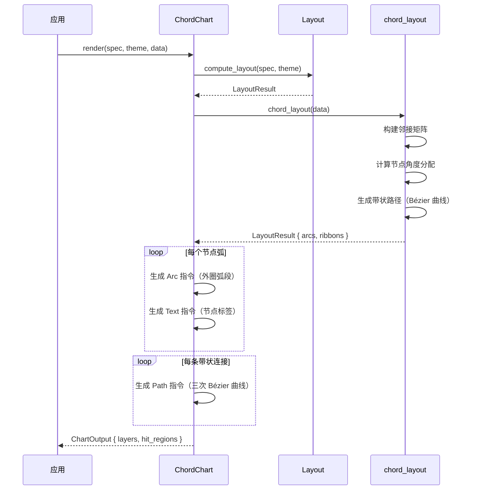

# 和弦图 ChordChart

用弧形和带状连接展示节点间的关系强度，适用于网络和矩阵数据。

## 基本用法

```rust
use deneb_component::{ChordChart, ChartSpec, Encoding, Field, Mark, DefaultTheme};
use deneb_core::parser::csv::parse_csv;

let table = parse_csv("source,target,value\nA,B,80\nA,C,40\nA,D,20\nB,C,60\nB,D,30\nC,D,50")?;

let spec = ChartSpec::builder()
    .mark(Mark::Chord)
    .encoding(Encoding::new()
        .x(Field::nominal("source"))
        .y(Field::nominal("target"))
        .size(Field::quantitative("value")))
    .width(800.0)
    .height(800.0)
    .build()?;

let output = ChordChart::render(&spec, &DefaultTheme, &table)?;
```

## 渲染流程



## 生成的绘图指令

| 指令 | 说明 |
|------|------|
| `Arc` (Data 层) | 节点外圈弧，每个节点一个 |
| `Path` (Data 层) | 带状连接，每条关系一个，使用三次 Bézier 曲线 |
| `Text` (Data 层) | 节点标签 |
| `Text` (Title 层) | 图表标题 |
| `Rect` (Background 层) | 背景填充 + 绘图区边框 |

## 比例尺

- **角度**：由 `chord_layout` 算法基于节点总流量分配
- **连接宽度**：与 value 值成正比，映射到带状宽度
- **Color**：节点颜色（如果指定了 color 编码），带状使用渐变混合源节点和目标节点颜色

## chord_layout 算法

从 lodviz-rs 移植的和弦图布局算法：

1. **构建邻接矩阵**：将 source→target 流量转换为 n×n 矩阵
2. **计算节点角度**：每个节点的角度 = 总流量 / 总流量 * 2π
3. **生成带状路径**：使用三次 Bézier 曲线连接弧段

```
          ┌─────────┐
       ┌──│  Node A │──┐
       │  └─────────┘  │
       ╱╲            ╱╲
      ╱  ╲          ╱  ╲
     ╱    ╲        ╱    ╲
    │  B   ╲______╱   C  │
    │      ╱      ╲      │
    ╲    ╱        ╲    ╱
     ╲  ╱          ╲  ╱
      ╲╱            ╲╱
       │            │
     ──┴────────────┴──
          └─────────┘
          ┌─────────┐
       ┌──│  Node D │──┐
       │  └─────────┘  │
```

- 外圈弧长度与节点总流量成比例
- 带状连接宽度与流量值成比例
- 带状使用渐变色（源→目标）

## 特殊行为

| 场景 | 行为 |
|------|------|
| 空矩阵 | 返回空绘图指令（仅 Background + Title） |
| 单节点 | 仅渲染该节点的完整圆环 |
| 零流连接 | 跳过该带状，但保留节点 |
| 自环（source=target） | 跳过（和弦图不允许自环） |
| 不对称流量 | 正常渲染，带状宽度反映方向性 |
| 空数据 | 仅返回 Background + Title 层 |
| 缺少必需字段 | 返回 `ComponentError` |

## 命中区域

每条带状连接和每个节点弧都生成 `HitRegion`：

- **带状连接**：沿 Bézier 路径的带状区域
- **节点弧**：外圈弧段的扇形区域

鼠标悬停时显示 tooltip，带状连接显示 source、target 和 value，节点弧显示节点名称和总流量。
