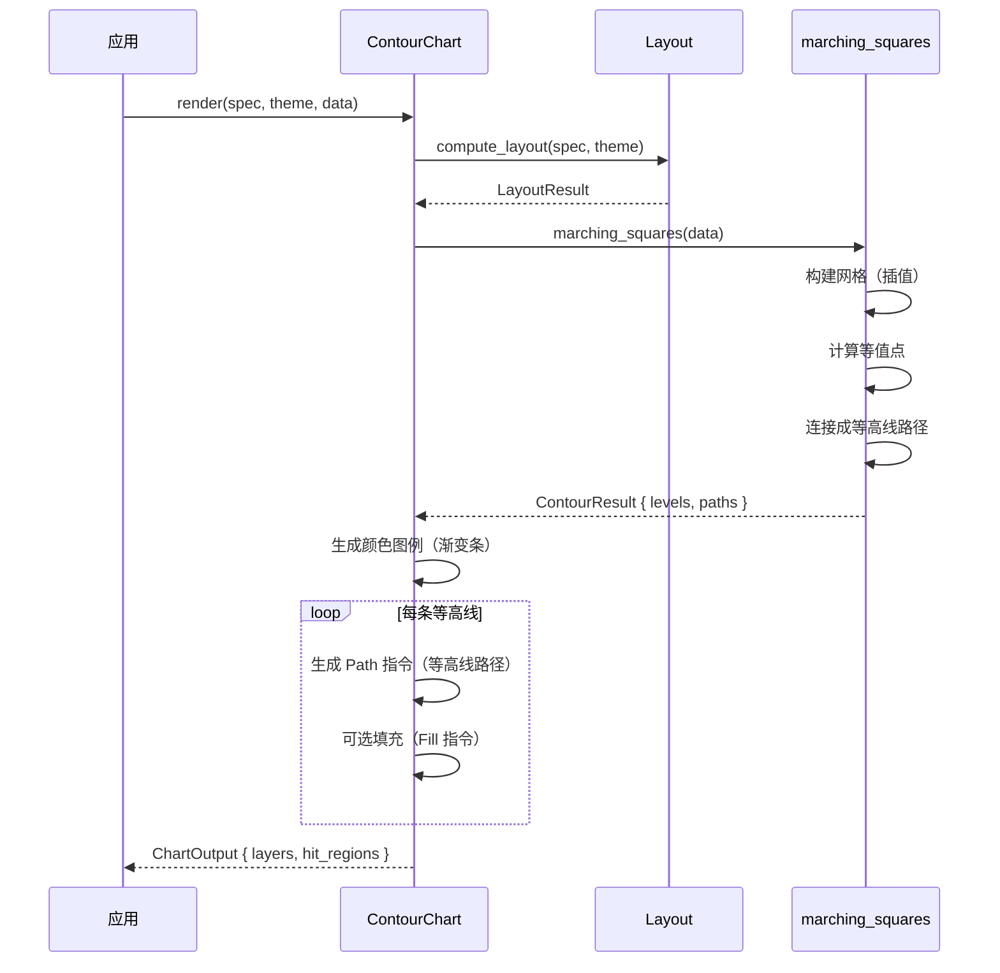

# 等高线图 ContourChart

用等高线表示二维数据的数值分布，展示连续值的梯度变化。

## 基本用法

```rust
use deneb_component::{ContourChart, ChartSpec, Encoding, Field, Mark, DefaultTheme};
use deneb_core::parser::csv::parse_csv;

let table = parse_csv("x,y,value\n1,1,10\n1,2,15\n1,3,20\n2,1,18\n2,2,25\n2,3,30\n3,1,22\n3,2,28\n3,3,35")?;

let spec = ChartSpec::builder()
    .mark(Mark::Contour)
    .encoding(Encoding::new()
        .x(Field::quantitative("x"))
        .y(Field::quantitative("y"))
        .color(Field::quantitative("value")))
    .width(800.0)
    .height(600.0)
    .build()?;

let output = ContourChart::render(&spec, &DefaultTheme, &table)?;
```

## 渲染流程



## 生成的绘图指令

| 指令 | 说明 |
|------|------|
| `Path` (Data 层) | 等高线路径，每条等值线一个 |
| `Path` (Fill 层) | 等高线填充（可选，用于连续色块） |
| `Rect` (Legend 层) | 颜色图例渐变条 |
| `Text` (Legend 层) | 颜色图例刻度标签 |
| `Text` (Axis 层) | 数值标签（X）、数值标签（Y）、轴标题 |
| `Text` (Title 层) | 图表标题 |
| `Rect` (Background 层) | 背景填充 + 绘图区边框 |

## 比例尺

- **X 轴**：`LinearScale`，数值映射到像素位置
- **Y 轴**：`LinearScale`，数值映射到像素位置，翻转
- **Color**：`LinearScale`，等值线数值映射到渐变色范围

## marching_squares 算法

从 lodviz-rs 移植的 Marching Squares 算法：

1. **构建网格**：将原始数据插值到规则网格
2. **计算等值点**：在每个网格边上通过线性插值找到等值点
3. **连接路径**：根据 16 种拓扑模式连接等值点

```
网格插值示例：

原始点：          插值网格：
  ●              ┌───┬───┐
  ●   ●      →   │   │   │
        ●        ├───┼───┤
                 │   │   │
                 └───┴───┘

等高线生成：
┌─────────────────────────────┐
│    ╱─────╲                  │
│   ╱       ╲   ╱───────╲     │
│  ●         ●           ●    │
│   ╲       ╱   ╲       ╱     │
│    ╲─────╱     ╲─────╱      │
└─────────────────────────────┘
```

- 网格密度可配置（默认 50×50）
- 等值线数量可配置（默认 10 条）
- 支持自动等值线间隔或手动指定

## 特殊行为

| 场景 | 行为 |
|------|------|
| 少于 3 个点 | 退化为散点图（ScatterChart） |
| 所有值相同 | 渲染单一等高线（或无等高线） |
| 稀疏数据 | 插值可能导致等高线不准确 |
| 数据边界 | 等高线在边界处可能被截断 |
| 空数据 | 仅返回 Background + Title 层 |
| 缺少必需字段 | 返回 `ComponentError` |

## 命中区域

等高线图通常不生成精确的 `HitRegion`，因为等高线是连续路径。可选方案：

- **网格区域**：将绘图区划分为网格，每个网格单元格作为命中区域
- **最近等值线**：鼠标位置到最近等值线的距离

鼠标悬停时显示 tooltip，显示鼠标位置（x, y）和插值后的 value 值。
