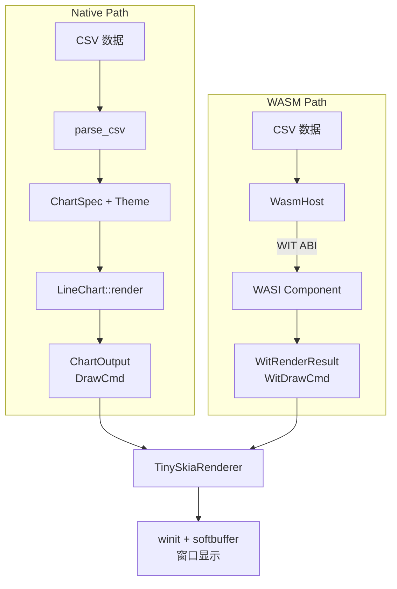

# Demo 演示

deneb-demo 提供四种图表类型的桌面演示，支持 Native 和 WASM 两种渲染路径。

## 运行 Demo

每个图表类型都有独立的 binary：

```bash
# Native 渲染（直接调用 deneb-component）
cargo run --bin demo-line
cargo run --bin demo-bar
cargo run --bin demo-scatter
cargo run --bin demo-area
```

### WASM 渲染路径

切换到 WASM 路径需要先编译 WASI Component，然后通过 `--wasm` 参数指定：

```bash
# 1. 编译 WASI Component
cargo build -p deneb-wit-wasm --target wasm32-wasip2 --release

# 2. 使用 WASM 路径运行
cargo run --bin demo-line -- --wasm target/wasm32-wasip2/release/deneb_wit_wasm.wasm
cargo run --bin demo-bar -- --wasm target/wasm32-wasip2/release/deneb_wit_wasm.wasm
cargo run --bin demo-scatter -- --wasm target/wasm32-wasip2/release/deneb_wit_wasm.wasm
cargo run --bin demo-area -- --wasm target/wasm32-wasip2/release/deneb_wit_wasm.wasm
```

## 双路径架构



两条路径产生视觉一致的输出。Native 路径使用完整 `DrawCmd` 枚举（无损），WASM 路径使用展平的 `WitDrawCmd`（跨 WASM 边界的编码格式）。

## 演示数据

每种图表使用内置的 CSV 示例数据：

| 图表 | 数据特征 | 字段 |
|------|---------|------|
| Line | 20 点时间序列 | x（连续）, y（连续） |
| Bar | 6 个类别 | category（离散）, value（连续） |
| Scatter | 两组聚类（A/B），20 点 | x, y, group |
| Area | 2 系列，12 点 | x, y1, y2 |

## Demo 代码结构

每个 demo binary 遵循相同模式：

```rust
fn main() -> Result<(), Box<dyn std::error::Error>> {
    let csv = sample_data::line_chart_csv();
    let args: Vec<String> = std::env::args().collect();

    let wasm_path = args.windows(2)
        .find(|w| w[0] == "--wasm")
        .map(|w| w[1].clone());

    if let Some(path) = wasm_path {
        run_wasm(&path, csv.as_bytes())?;
    } else {
        run_direct(csv)?;
    }
    Ok(())
}
```

### Native 路径

```rust
fn run_direct(csv: &str) -> Result<(), Box<dyn std::error::Error>> {
    let table = parse_csv(csv)?;

    let spec = ChartSpec::builder()
        .mark(Mark::Line)
        .encoding(Encoding::new()
            .x(Field::quantitative("x"))
            .y(Field::quantitative("y")))
        .title("Line Chart Demo")
        .width(800.0)
        .height(600.0)
        .build()?;

    let output = LineChart::render(&spec, &DefaultTheme, &table)?;

    let mut renderer = TinySkiaRenderer::new(800, 600)?;
    renderer.render_layers(&output.layers);

    let app = DemoApp::new("Deneb - Line Chart", 800, 600);
    app.run(renderer.pixmap().clone())
}
```

### WASM 路径

```rust
fn run_wasm(wasm_path: &str, data: &[u8]) -> Result<(), Box<dyn std::error::Error>> {
    let mut host = WasmHost::from_file(wasm_path)?;

    let wit_spec = WitChartSpec {
        mark: "line".to_string(),
        x_field: "x".to_string(),
        y_field: "y".to_string(),
        color_field: None,
        width: 800.0,
        height: 600.0,
        title: Some("Line Chart Demo (WASM)".to_string()),
        theme: None,
    };

    let wit_result = host.render(data, "csv", &wit_spec)?;

    let mut renderer = TinySkiaRenderer::new(800, 600)?;
    renderer.render_wit_layers(&wit_result.layers);

    let app = DemoApp::new("Deneb - Line Chart (WASM)", 800, 600);
    app.run(renderer.pixmap().clone())
}
```

## 渲染器

deneb-demo 使用 `TinySkiaRenderer` 将 Canvas 2D 指令转换为像素。它同时支持 `DrawCmd`（Native）和 `WitDrawCmd`（WASM）两种输入格式。

| 指令 | tiny-skia 映射 |
|------|---------------|
| `DrawCmd::Rect` | `fill_rect()` / `stroke_rect()` |
| `DrawCmd::Path` | `PathBuilder` + `fill_path()` / `stroke_path()` |
| `DrawCmd::Circle` | `PathBuilder::from_circle()` + fill/stroke |
| `DrawCmd::Text` | fontdue 栅格化 + 像素混合 |
| `DrawCmd::Group` | 递归处理 children（Native）/ group-depth 线性处理（WASM） |
