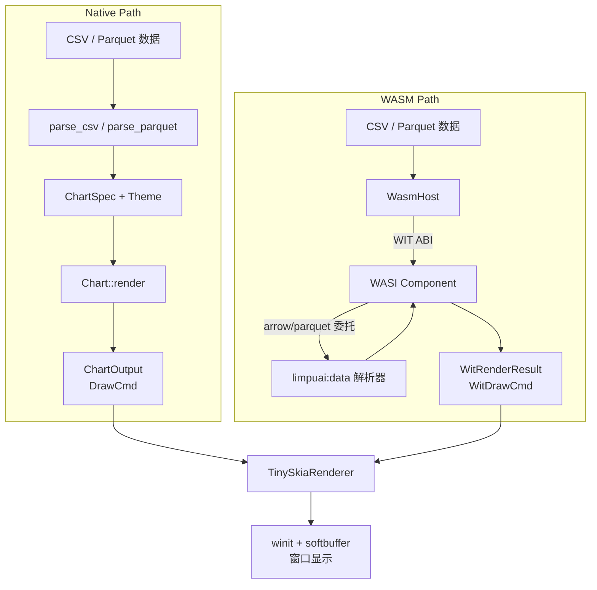
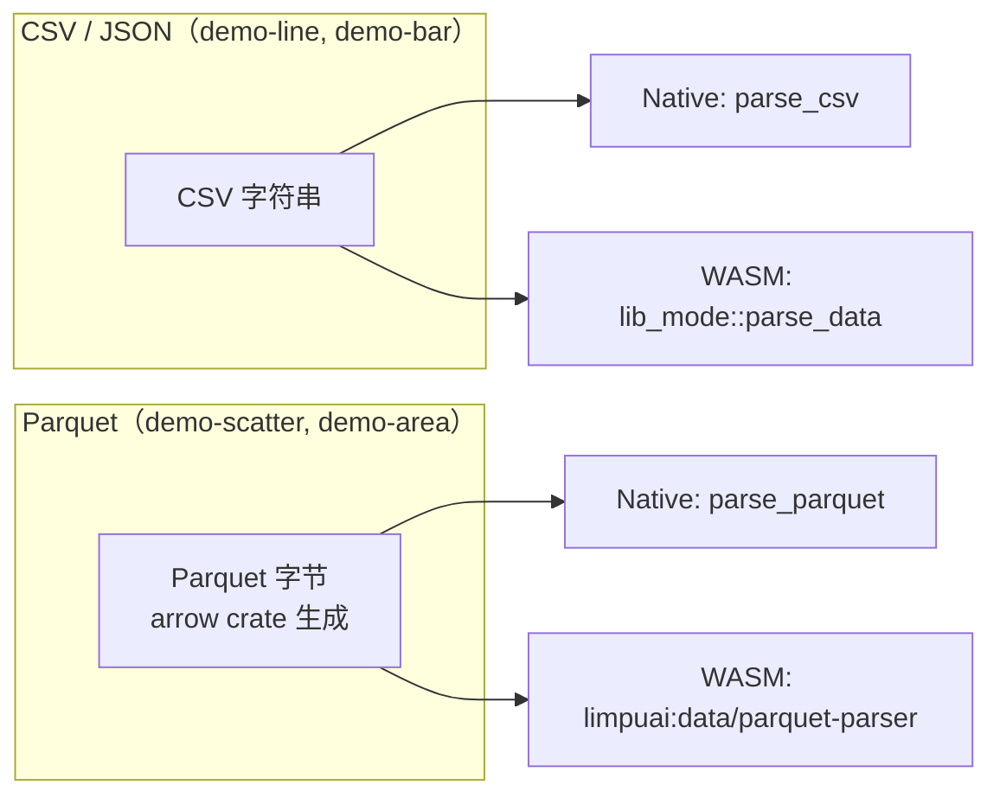

# Demo 演示

deneb-demo 提供十五种图表类型的桌面演示，支持 Native 和 WASM 两种渲染路径。

## 运行 Demo

每个图表类型都有独立的 binary：

```bash
# Native 渲染（直接调用 deneb-component）
cargo run --bin demo-line
cargo run --bin demo-bar
cargo run --bin demo-scatter
cargo run --bin demo-area
cargo run --bin demo-pie
cargo run --bin demo-histogram
cargo run --bin demo-boxplot
cargo run --bin demo-waterfall
cargo run --bin demo-candlestick
cargo run --bin demo-radar
cargo run --bin demo-heatmap
cargo run --bin demo-strip
cargo run --bin demo-sankey
cargo run --bin demo-chord
cargo run --bin demo-contour
```

### WASM 渲染路径

切换到 WASM 路径需要先编译 WASI Component，然后通过 `--wasm` 参数指定：

```bash
# 1. 编译 WASI Component
cargo build -p deneb-wit-wasm --target wasm32-wasip2 --release

# 2. 使用 WASM 路径运行（CSV/JSON 格式，无需外部解析器）
cargo run --bin demo-line -- --wasm target/wasm32-wasip2/release/deneb_wit_wasm.wasm
cargo run --bin demo-bar -- --wasm target/wasm32-wasip2/release/deneb_wit_wasm.wasm
cargo run --bin demo-pie -- --wasm target/wasm32-wasip2/release/deneb_wit_wasm.wasm
cargo run --bin demo-histogram -- --wasm target/wasm32-wasip2/release/deneb_wit_wasm.wasm
cargo run --bin demo-boxplot -- --wasm target/wasm32-wasip2/release/deneb_wit_wasm.wasm
cargo run --bin demo-waterfall -- --wasm target/wasm32-wasip2/release/deneb_wit_wasm.wasm
cargo run --bin demo-candlestick -- --wasm target/wasm32-wasip2/release/deneb_wit_wasm.wasm
cargo run --bin demo-radar -- --wasm target/wasm32-wasip2/release/deneb_wit_wasm.wasm
cargo run --bin demo-heatmap -- --wasm target/wasm32-wasip2/release/deneb_wit_wasm.wasm
cargo run --bin demo-strip -- --wasm target/wasm32-wasip2/release/deneb_wit_wasm.wasm
cargo run --bin demo-sankey -- --wasm target/wasm32-wasip2/release/deneb_wit_wasm.wasm
cargo run --bin demo-chord -- --wasm target/wasm32-wasip2/release/deneb_wit_wasm.wasm
cargo run --bin demo-contour -- --wasm target/wasm32-wasip2/release/deneb_wit_wasm.wasm

# 3. Parquet 格式需要 --deps 指定解析器组件目录
cargo run --bin demo-scatter -- \
  --wasm target/wasm32-wasip2/release/deneb_wit_wasm.wasm \
  --deps ../limpuai-wit/target/wasm32-wasip2/release
cargo run --bin demo-area -- \
  --wasm target/wasm32-wasip2/release/deneb_wit_wasm.wasm \
  --deps ../limpuai-wit/target/wasm32-wasip2/release
```

`--deps <dir>` 按文件名约定自动发现解析器组件：
- `limpuai_wit_arrow.wasm` → Arrow IPC 解析器
- `limpuai_wit_parquet.wasm` → Parquet 解析器

找到则链接，未找到则注册 stub（调用时返回错误）。

## 双路径架构



两条路径产生视觉一致的输出。Native 路径使用完整 `DrawCmd` 枚举（无损），WASM 路径使用展平的 `WitDrawCmd`（跨 WASM 边界的编码格式）。

## 数据格式



| 图表 | 数据格式 | 数据特征 | 字段 |
|------|---------|---------|------|
| Line | CSV | 20 点时间序列 | x（连续）, y（连续） |
| Bar | CSV | 6 个类别 | category（离散）, value（连续） |
| Scatter | Parquet | 两组聚类（A/B），20 点 | x（Float64）, y（Float64）, group（Utf8） |
| Area | Parquet | 2 系列，12 点 | x（Int64）, y1（Int64）, y2（Int64） |
| Pie | CSV | 5 个类别，占比 | category（离散）, value（连续） |
| Histogram | CSV | 连续数据分布，自动分箱 | value（连续） |
| BoxPlot | CSV | 分组数据，统计分布 | category（离散）, value（连续） |
| Waterfall | CSV | 累计增减 | step（离散）, value（连续） |
| Candlestick | CSV | OHLC 金融数据 | x（时间）, open（连续）, high（连续）, low（连续）, close（连续） |
| Radar | CSV | 多维度数据 | dimension（离散）, value（连续） |
| Heatmap | CSV | 二维数据密度 | x（连续）, y（连续）, value（连续） |
| Strip | CSV | 分类数据点分布 | category（离散）, value（连续） |
| Sankey | CSV | 流量流向关系 | source（离散）, target（离散）, value（连续） |
| Chord | CSV | 节点相互关系 | source（离散）, target（离散）, value（连续） |
| Contour | CSV | 二维标量场 | x（连续）, y（连续）, z（连续） |

## Demo 代码结构

每个 demo binary 遵循相同模式，使用公共的 `parse_wasm_args()` 提取 CLI 参数：

```rust
fn main() -> Result<(), Box<dyn std::error::Error>> {
    let csv = sample_data::line_chart_csv();

    if let Some(args) = parse_wasm_args() {
        let parsers = args.deps_dir.as_deref()
            .map(ParserPaths::from_dir)
            .unwrap_or_default();
        let mut host = WasmHost::from_file_with_parsers(&args.wasm_path, parsers)?;
        run_wasm(&mut host, csv.as_bytes())?;
    } else {
        run_direct(csv)?;
    }
    Ok(())
}
```

### Native 路径

```rust
fn run_direct(csv: &str) -> Result<(), Box<dyn std::error::Error>> {
    let table = parse_csv(csv)?;

    let spec = ChartSpec::builder()
        .mark(Mark::Line)
        .encoding(Encoding::new()
            .x(Field::quantitative("x"))
            .y(Field::quantitative("y")))
        .title("Line Chart Demo")
        .width(800.0)
        .height(600.0)
        .build()?;

    let output = LineChart::render(&spec, &DefaultTheme, &table)?;

    let mut renderer = TinySkiaRenderer::new(800, 600)?;
    renderer.render_layers(&output.layers);

    let app = DemoApp::new("Deneb - Line Chart", 800, 600);
    app.run(renderer.pixmap().clone())
}
```

### WASM 路径

```rust
fn run_wasm(host: &mut WasmHost, data: &[u8]) -> Result<(), Box<dyn std::error::Error>> {
    let wit_spec = WitChartSpec {
        mark: "line".to_string(),
        x_field: "x".to_string(),
        y_field: "y".to_string(),
        color_field: None,
        open_field: None,
        high_field: None,
        low_field: None,
        close_field: None,
        theta_field: None,
        size_field: None,
        width: 800.0,
        height: 600.0,
        title: Some("Line Chart Demo (WASM)".to_string()),
        theme: None,
    };

    let wit_result = host.render(data, "csv", &wit_spec)?;

    let mut renderer = TinySkiaRenderer::new(800, 600)?;
    renderer.render_wit_layers(&wit_result.layers);

    let app = DemoApp::new("Deneb - Line Chart (WASM)", 800, 600);
    app.run(renderer.pixmap().clone())
}
```

## 渲染器

deneb-demo 使用 `TinySkiaRenderer` 将 Canvas 2D 指令转换为像素。它同时支持 `DrawCmd`（Native）和 `WitDrawCmd`（WASM）两种输入格式。

| 指令 | tiny-skia 映射 |
|------|---------------|
| `DrawCmd::Rect` | `fill_rect()` / `stroke_rect()` |
| `DrawCmd::Path` | `PathBuilder` + `fill_path()` / `stroke_path()` |
| `DrawCmd::Circle` | `PathBuilder::from_circle()` + fill/stroke |
| `DrawCmd::Text` | fontdue 栅格化 + 像素混合 |
| `DrawCmd::Group` | 递归处理 children（Native）/ group-depth 线性处理（WASM） |
| `DrawCmd::Arc` | `PathBuilder::push_arc()` + fill/stroke |
