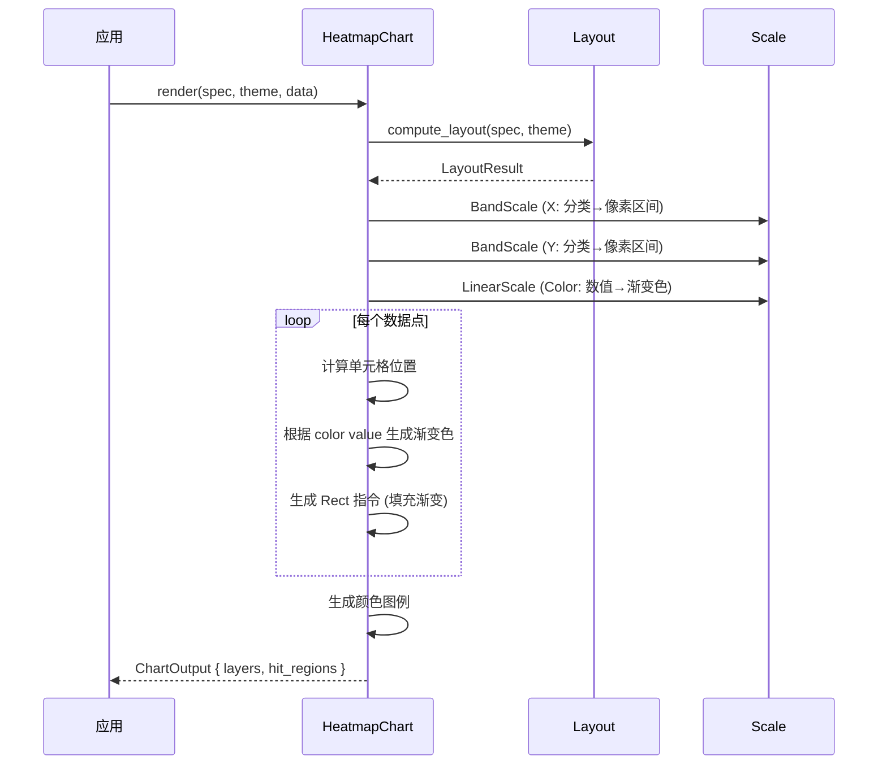

# 热力图 HeatmapChart

用网格单元格颜色深浅表示两个维度交叉点上的数值大小。

## 基本用法

```rust
use deneb_component::{HeatmapChart, ChartSpec, Encoding, Field, Mark, DefaultTheme};
use deneb_core::parser::csv::parse_csv;

let table = parse_csv("weekday,hour,value\nMon,9,45\nMon,12,78\nMon,15,32\nTue,9,62\nTue,12,85\nTue,15,48")?;

let spec = ChartSpec::builder()
    .mark(Mark::Heatmap)
    .encoding(Encoding::new()
        .x(Field::nominal("weekday"))
        .y(Field::nominal("hour"))
        .color(Field::quantitative("value")))
    .width(800.0)
    .height(600.0)
    .build()?;

let output = HeatmapChart::render(&spec, &DefaultTheme, &table)?;
```

## 渲染流程



## 生成的绘图指令

| 指令 | 说明 |
|------|------|
| `Rect` (Data 层) | 热力图单元格，每个数据点一个，填充渐变色 |
| `Rect` (Legend 层) | 颜色图例渐变条 |
| `Text` (Legend 层) | 颜色图例刻度标签 |
| `Text` (Axis 层) | 分类标签（X）、分类标签（Y）、轴标题 |
| `Text` (Title 层) | 图表标题 |
| `Rect` (Background 层) | 背景填充 + 绘图区边框 |

## 比例尺

- **X 轴**：`BandScale`，分类数据映射到等宽区间，padding = 0.0（单元格紧密排列）
- **Y 轴**：`BandScale`，分类数据映射到等宽区间，padding = 0.0
- **Color**：`LinearScale`，数值映射到渐变色范围（通常蓝色→红色）

## 特殊行为

| 场景 | 行为 |
|------|------|
| 单个单元格 | 正常渲染，颜色图例基于该值 |
| 所有值相同 | 所有单元格颜色相同，颜色图例显示单一值 |
| 空数据 | 仅返回 Background + Title 层 |
| 缺少必需字段 | 返回 `ComponentError` |
| 数值为 null/NaN | 跳过该单元格，留空或填充灰色 |

## 命中区域

每个单元格生成一个矩形 `HitRegion`，精确匹配单元格的像素范围（x, y, width, height）。鼠标悬停时显示 tooltip，包含 x、y 和 color 值。
