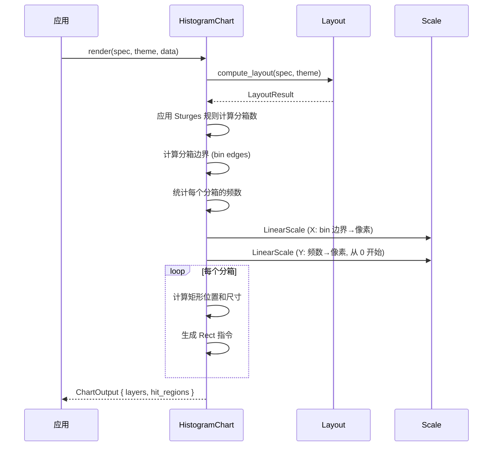

# 直方图 HistogramChart

用柱状条高度表示数值数据的分布情况，自动进行分组统计。

## 基本用法

```rust
use deneb_component::{HistogramChart, ChartSpec, Encoding, Field, Mark, DefaultTheme};
use deneb_core::parser::csv::parse_csv;

let table = parse_csv("value\n23\n45\n67\n34\n56\n78\n45\n67\n89\n34\n56\n78\n45")?;

let spec = ChartSpec::builder()
    .mark(Mark::Histogram)
    .encoding(Encoding::new()
        .x(Field::quantitative("value")))
    .width(800.0)
    .height(600.0)
    .build()?;

let output = HistogramChart::render(&spec, &DefaultTheme, &table)?;
```

## 渲染流程



## 生成的绘图指令

| 指令 | 说明 |
|------|------|
| `Rect` (Data 层) | 柱状条，每个分箱一个 |
| `Path` (Grid 层) | 水平网格线 |
| `Path` (Axis 层) | 坐标轴线 + 刻度标记 |
| `Text` (Axis 层) | 分箱边界标签（X）、频数标签（Y）、轴标题 |
| `Text` (Title 层) | 图表标题 |
| `Rect` (Background 层) | 背景填充 + 绘图区边框 |

## 分箱算法

使用 **Sturges 规则** 计算最佳分箱数：

```
bin_count = ceil(1 + log2(n))
```

其中 `n` 为数据点数量。分箱边界均匀分布在数据的最小值和最大值之间。

示例：
- 100 个数据点 → bin_count = 8
- 1000 个数据点 → bin_count = 11
- 10 个数据点 → bin_count = 5

## 比例尺

- **X 轴**：`LinearScale`，分箱边界映射到像素
- **Y 轴**：`LinearScale`，频数映射到像素，范围从 0 开始，**必须从 0 开始**（柱状图变体）

## 特殊行为

| 场景 | 行为 |
|------|------|
| 所有值相同 | 单个分箱包含所有点 |
| 少于 5 个数据点 | 最小 2 个分箱 |
| 空数据 | 仅返回 Background + Title 层 |
| 负数值 | 正常分箱统计 |
| 缺少必需字段 | 返回 `ComponentError` |

## 命中区域

每个柱状条生成一个矩形 `HitRegion`，精确匹配柱状条的像素范围（x, y, width, height）。
