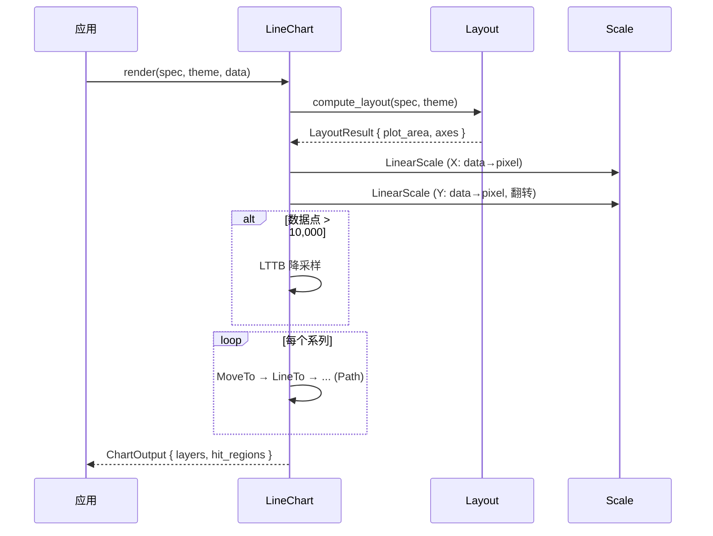

# 折线图 LineChart

将连续数据点连接为折线，适用于时间序列和趋势展示。

## 基本用法

```rust
use deneb_component::{ChartSpec, Encoding, Field, LineChart, Mark, DefaultTheme};
use deneb_core::parser::csv::parse_csv;

let table = parse_csv("x,y\n0,10\n1,25\n2,18\n3,32\n4,28")?;

let spec = ChartSpec::builder()
    .mark(Mark::Line)
    .encoding(Encoding::new()
        .x(Field::quantitative("x"))
        .y(Field::quantitative("y")))
    .width(800.0)
    .height(600.0)
    .build()?;

let output = LineChart::render(&spec, &DefaultTheme, &table)?;
```

## 渲染流程



## 生成的绘图指令

| 指令 | 说明 |
|------|------|
| `Path` (Data 层) | 折线路径：MoveTo + LineTo 序列 |
| `Path` (Grid 层) | X/Y 方向的网格线 |
| `Path` (Axis 层) | 坐标轴线 |
| `Text` (Axis 层) | 刻度标签、轴标题 |
| `Text` (Title 层) | 图表标题 |
| `Rect` (Background 层) | 背景填充 |

## 多系列

通过 `color` 编码通道启用多系列，每个系列独立渲染一条折线：

```rust
let spec = ChartSpec::builder()
    .mark(Mark::Line)
    .encoding(Encoding::new()
        .x(Field::quantitative("x"))
        .y(Field::quantitative("y"))
        .color(Field::nominal("series")))
    .build()?;
```

- 按颜色字段值分组，每组一条线
- 系列按名称字母序排列
- 颜色从主题调色板循环取色

## 特殊行为

| 场景 | 行为 |
|------|------|
| 单数据点 | 退化为 `Circle` 指令（一个点） |
| 空数据 | 仅返回 Background 层 |
| 常量 Y 值 | 正常渲染水平线 |
| 数据点 > 10,000 | 自动 LTTB 降采样 |
| 时间轴 X | 自动切换为 `TimeScale` |

## 比例尺

- **X 轴**：`LinearScale`（Quantitative）或 `TimeScale`（Temporal）
- **Y 轴**：`LinearScale`，范围翻转（值增大 → 像素向上）

## 命中区域

每个数据点生成一个 `HitRegion`，半径 5 像素，包含该行的完整数据。
