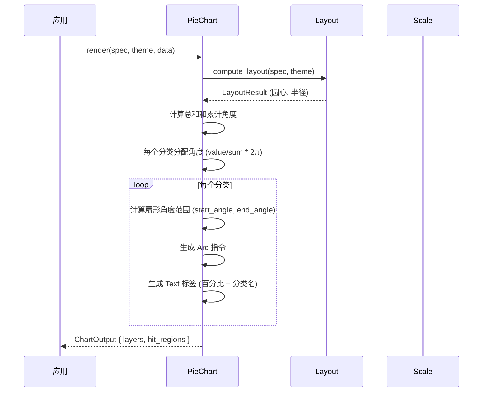

# 饼图 PieChart

使用扇形角度表示分类数据的占比。

## 基本用法

```rust
use deneb_component::{PieChart, ChartSpec, Encoding, Field, Mark, DefaultTheme};
use deneb_core::parser::csv::parse_csv;

let table = parse_csv("category,value\nA,30\nB,55\nC,42\nD,68\nE,35")?;

let spec = ChartSpec::builder()
    .mark(Mark::Pie)
    .encoding(Encoding::new()
        .x(Field::nominal("category"))
        .y(Field::quantitative("value")))
    .width(800.0)
    .height(600.0)
    .build()?;

let output = PieChart::render(&spec, &DefaultTheme, &table)?;
```

## 渲染流程



## 生成的绘图指令

| 指令 | 说明 |
|------|------|
| `Arc` (Data 层) | 扇形，每个分类一个 |
| `Text` (Data 层) | 标签（分类名 + 百分比） |
| `Text` (Title 层) | 图表标题 |
| `Rect` (Background 层) | 背景填充 |

## 环形图（甜甜圈图）

```rust
let spec = ChartSpec::builder()
    .mark(Mark::Pie)
    .encoding(Encoding::new()
        .x(Field::nominal("category"))
        .y(Field::quantitative("value")))
    .inner_radius(0.4) // 内半径 40%，形成环形
    .build()?;
```

- 设置 `inner_radius` > 0 时，扇形变为环形
- 标签位置自动调整到扇形中间

```
    ┌─────────────────────┐
    │      ████████      │ ← 外半径
    │     ██      ██     │
    │    ██        ██    │
    │    ██  空心  ██    │ ← 内半径
    │     ██      ██     │
    │      ████████      │
    └─────────────────────┘
```

## 比例尺

- **无标准坐标轴**
- **角度比例尺**：累计从 0 到 2π，按数值占比分配角度
- **径向比例尺**：从圆心到外半径，用于内半径配置

## 特殊行为

| 场景 | 行为 |
|------|------|
| 空数据 | 仅返回 Background + Title 层 |
| 全零值 | 所有分类等分角度 (1/n * 2π) |
| 负数值 | 绝对值计算占比 |
| 缺少必需字段 | 返回 `ComponentError` |
| 单个分类 | 生成完整圆形扇形 |

## 命中区域

每个扇形生成一个 `HitRegion`，范围对应扇形的边界框（bounding box）。
