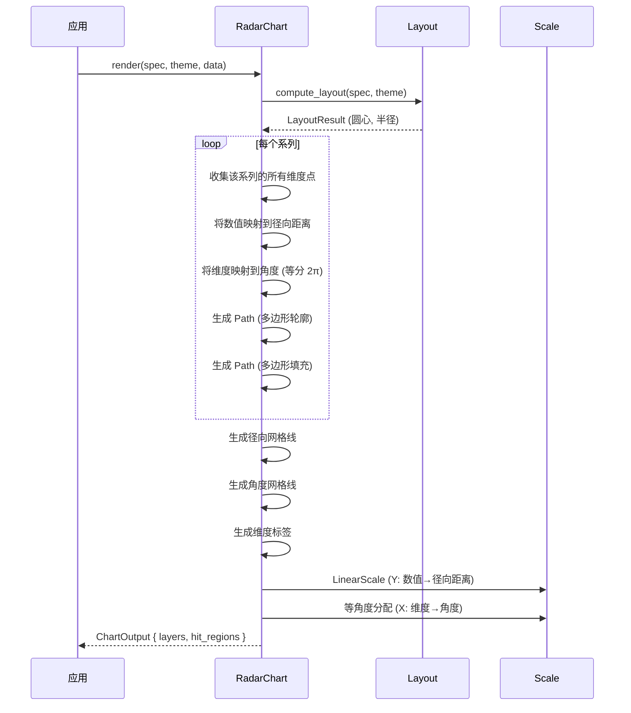

# 雷达图 RadarChart

用多边形极坐标布局表示多维数据对比。

## 基本用法

```rust
use deneb_component::{RadarChart, ChartSpec, Encoding, Field, Mark, DefaultTheme};
use deneb_core::parser::csv::parse_csv;

let table = parse_csv("dimension,value,series\nSpeed,85,A\nPower,92,A\nTech,78,A\nSpeed,70,B\nPower,85,B\nTech,90,B")?;

let spec = ChartSpec::builder()
    .mark(Mark::Radar)
    .encoding(Encoding::new()
        .x(Field::nominal("dimension"))
        .y(Field::quantitative("value"))
        .color(Field::nominal("series")))
    .width(800.0)
    .height(600.0)
    .build()?;

let output = RadarChart::render(&spec, &DefaultTheme, &table)?;
```

## 渲染流程



## 生成的绘图指令

| 指令 | 说明 |
|------|------|
| `Path` (Data 层) | 多边形轮廓（stroke） |
| `Path` (Data 层) | 多边形填充（fill） |
| `Path` (Grid 层) | 径向网格线（同心圆） |
| `Path` (Grid 层) | 角度网格线（辐射线） |
| `Text` (Axis 层) | 维度标签 |
| `Text` (Legend 层) | 系列图例 |
| `Text` (Title 层) | 图表标题 |
| `Rect` (Background 层) | 背景填充 |

## 雷达图结构

多系列对比，每个维度等分角度：

```
         Power (90°)
              │
              │
              │
     Tech ────┼──── Speed
    (135°)   │    (45°)
              │
              │
              │
         Agility (0°)
```

**角度分配**：
- n 个维度 → 每个维度分配 `2π/n` 角度
- 第 i 个维度的角度 = `i * 2π/n`

**多系列**：
- 每个系列用不同颜色绘制多边形
- 半透明填充避免遮挡

## 比例尺

- **Y 轴**：`LinearScale`，数值映射到径向距离（从圆心到外边缘）
- **X 轴**：等角度分配，维度均匀分布

## 特殊行为

| 场景 | 行为 |
|------|------|
| 少于 2 个维度 | 空渲染（至少 2 个维度才能形成多边形） |
| 所有值相同 | 多边形退化为圆形 |
| 负数值 | 绝对值处理（距离不能为负） |
| 空数据 | 仅返回 Background + Title 层 |
| 缺少必需字段 | 返回 `ComponentError` |

## 命中区域

每个多边形生成一个 `HitRegion`，范围对应多边形的边界框（bounding box）。
