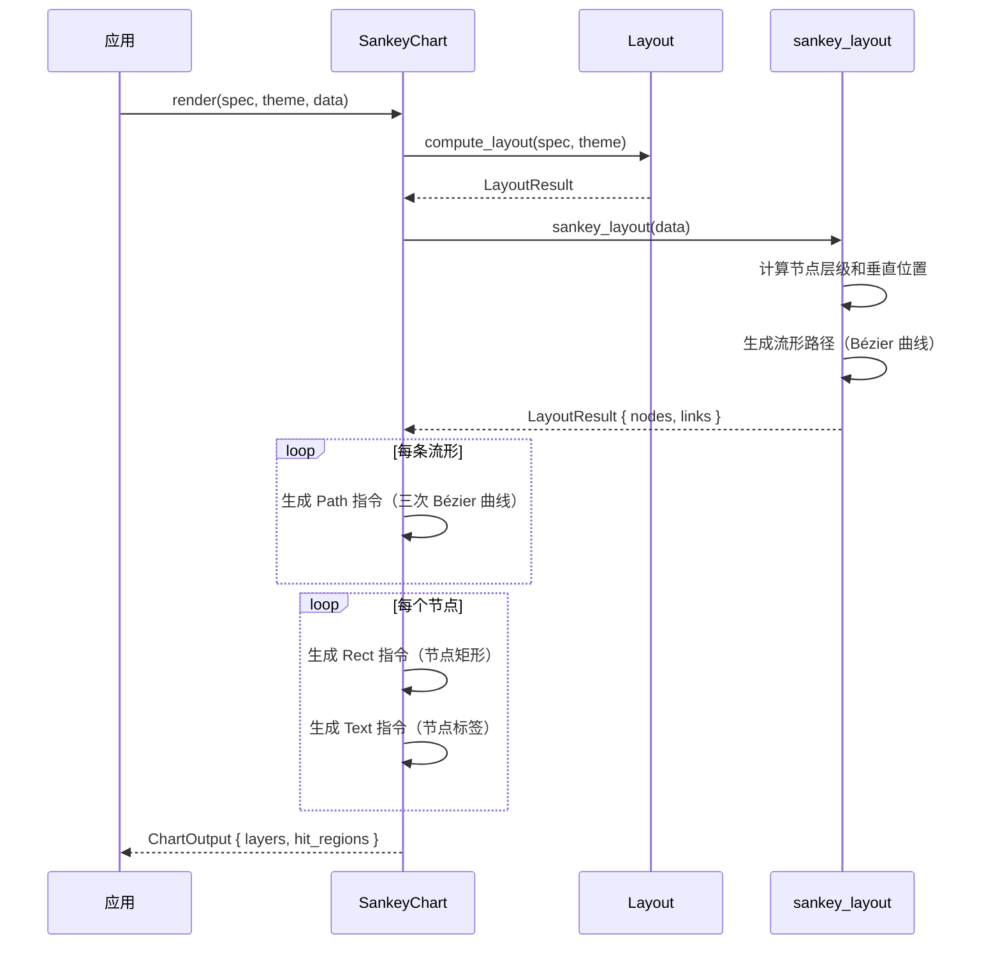

# 桑基图 SankeyChart

用流形宽度表示节点间的流量关系，展示数据流向和数量。

## 基本用法

```rust
use deneb_component::{SankeyChart, ChartSpec, Encoding, Field, Mark, DefaultTheme};
use deneb_core::parser::csv::parse_csv;

let table = parse_csv("source,target,flow\nA,B,100\nA,C,50\nB,D,80\nC,D,40\nC,E,10")?;

let spec = ChartSpec::builder()
    .mark(Mark::Sankey)
    .encoding(Encoding::new()
        .x(Field::nominal("source"))
        .y(Field::nominal("target"))
        .size(Field::quantitative("flow")))
    .width(800.0)
    .height(600.0)
    .build()?;

let output = SankeyChart::render(&spec, &DefaultTheme, &table)?;
```

## 渲染流程



## 生成的绘图指令

| 指令 | 说明 |
|------|------|
| `Path` (Data 层) | 流形带，每条流向一个，使用三次 Bézier 曲线 |
| `Rect` (Data 层) | 节点矩形，每个节点一个，高度与流入/流出流量成比例 |
| `Text` (Data 层) | 节点标签 |
| `Text` (Title 层) | 图表标题 |
| `Rect` (Background 层) | 背景填充 + 绘图区边框 |

## 比例尺

- **位置**：由 `sankey_layout` 算法确定，节点按层级排列（从左到右）
- **Flow 大小**：数值直接映射到流形带宽度和节点高度
- **Color**：流形颜色基于 source 节点的颜色（如果指定了 color 编码）

## sankey_layout 算法

从 lodviz-rs 移植的桑基图布局算法：

1. **节点层级分配**：BFS 遍历，确保无环（cycle → 报错）
2. **节点垂直位置**：按流量大小排列，居中对齐
3. **流形路径生成**：使用三次 Bézier 曲线连接节点边缘

```
Layer 1    Layer 2    Layer 3
┌─────┐    ┌─────┐    ┌─────┐
│  A  │╮──►│  B  │╮──►│  D  │
└─────┘│   └─────┘│   └─────┘
       │╮         │
       │╰──►┌─────┴─┐
       │    │  C    │╮
       │    └───────┘│
       │             │╮
       │             │╰──►┌─────┐
       │                  │  E  │
       │                  └─────┘
```

- 流形宽度与 flow 值成正比
- 流形在节点边缘垂直对齐
- 多条流入/流出流形在节点内垂直堆叠

## 特殊行为

| 场景 | 行为 |
|------|------|
| 零流 | 该流形跳过，但节点保留 |
| 循环检测 | 返回 `ComponentError::InvalidData`（sankey 不允许环） |
| 单节点 | 仅渲染该节点，无边 |
| 空数据 | 仅返回 Background + Title 层 |
| 缺少必需字段 | 返回 `ComponentError` |

## 命中区域

每条流形和每个节点都生成 `HitRegion`：

- **流形**：沿 Bézier 路径的带状区域
- **节点**：节点的矩形区域

鼠标悬停时显示 tooltip，流形显示 source、target 和 flow 值，节点显示节点名称和总流量。
