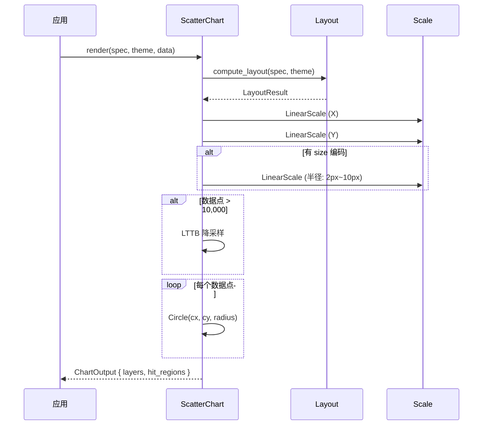

# 散点图 ScatterChart

展示两组数值变量的关系，每个数据点渲染为一个圆。

## 基本用法

```rust
use deneb_component::{ChartSpec, Encoding, Field, Mark, ScatterChart, DefaultTheme};
use deneb_core::parser::csv::parse_csv;

let table = parse_csv("x,y,group\n1.2,3.4,A\n2.5,4.1,B\n3.1,2.8,A")?;

let spec = ChartSpec::builder()
    .mark(Mark::Scatter)
    .encoding(Encoding::new()
        .x(Field::quantitative("x"))
        .y(Field::quantitative("y"))
        .color(Field::nominal("group")))
    .width(800.0)
    .height(600.0)
    .build()?;

let output = ScatterChart::render(&spec, &DefaultTheme, &table)?;
```

## 渲染流程



## 生成的绘图指令

| 指令 | 说明 |
|------|------|
| `Circle` (Data 层) | 每个数据点一个圆 |
| `Path` (Grid 层) | X/Y 方向网格线 |
| `Path` (Axis 层) | 坐标轴线 |
| `Text` (Axis 层) | 刻度标签、轴标题 |
| `Text` (Title 层) | 图表标题 |
| `Rect` (Background 层) | 背景填充 |

## 大小编码

通过 `size` 编码通道将数值映射到点半径：

```rust
let spec = ChartSpec::builder()
    .mark(Mark::Scatter)
    .encoding(Encoding::new()
        .x(Field::quantitative("x"))
        .y(Field::quantitative("y"))
        .size(Field::quantitative("population")))
    .build()?;
```

- 默认半径：4px
- 有 size 编码时：`LinearScale` 映射到 2px~10px 范围

## 多系列

通过 `color` 编码通道区分不同类别，每个类别使用不同颜色：

```
      │  ·  ◆
      │·    ◆   ·
   ◆  │  ·     ◆
  ·   │◆   ·
      │  ◆   ·
      └──────────
       ● = A组   ◆ = B组
```

所有系列的点渲染在同一个 Data 层，不按组分层。

## 比例尺

- **X 轴**：`LinearScale`（Quantitative）或 `TimeScale`（Temporal）
- **Y 轴**：`LinearScale`，翻转
- **Size**（可选）：`LinearScale`，映射到 2~10px 半径

## 特殊行为

| 场景 | 行为 |
|------|------|
| 空数据 | 仅返回 Background 层 |
| 数据点 > 10,000 | 自动 LTTB 降采样 |
| 无 size 编码 | 固定 4px 半径 |

## 命中区域

每个点生成一个 `HitRegion`，半径匹配渲染半径（有 size 编码时为映射后的值，否则为 4px）。
