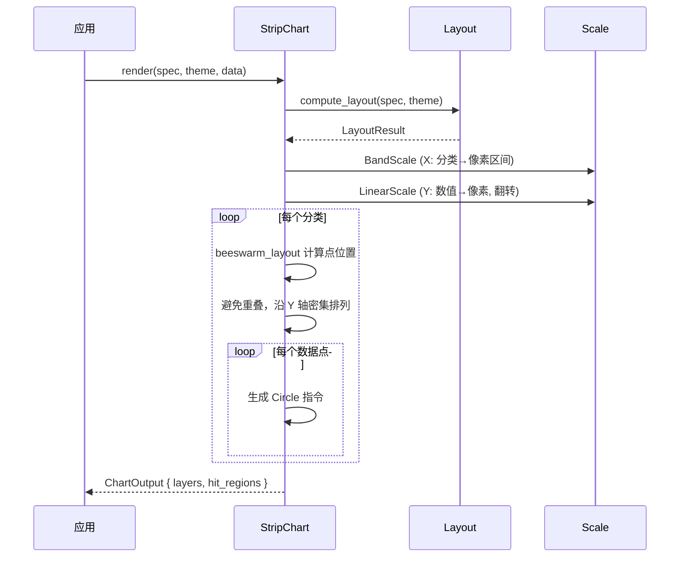

# 蜂群图 StripChart

用散点展示分类数据的分布情况，通过蜂群布局算法避免点重叠。

## 基本用法

```rust
use deneb_component::{StripChart, ChartSpec, Encoding, Field, Mark, DefaultTheme};
use deneb_core::parser::csv::parse_csv;

let table = parse_csv("category,value,group\nA,12,G1\nA,15,G2\nA,18,G1\nB,25,G1\nB,28,G2\nB,30,G1\nC,8,G2\nC,10,G1\nC,12,G2")?;

let spec = ChartSpec::builder()
    .mark(Mark::Strip)
    .encoding(Encoding::new()
        .x(Field::nominal("category"))
        .y(Field::quantitative("value"))
        .color(Field::nominal("group")))
    .width(800.0)
    .height(600.0)
    .build()?;

let output = StripChart::render(&spec, &DefaultTheme, &table)?;
```

## 渲染流程



## 生成的绘图指令

| 指令 | 说明 |
|------|------|
| `Circle` (Data 层) | 散点圆圈，每个数据点一个 |
| `Path` (Grid 层) | 水平网格线 |
| `Path` (Axis 层) | 坐标轴线 + 刻度标记 |
| `Text` (Axis 层) | 分类标签（X）、数值标签（Y）、轴标题 |
| `Text` (Title 层) | 图表标题 |
| `Rect` (Background 层) | 背景填充 + 绘图区边框 |

## 比例尺

- **X 轴**：`BandScale`，分类数据映射到等宽区间，padding = 0.1
- **Y 轴**：`LinearScale`，范围包含 0 点，翻转
- **Color**：`Nominal`，分组数据映射到离散颜色

## 蜂群布局算法

每个分类内，数据点通过以下步骤排列：

1. 按 Y 值降序排序
2. 从顶部开始放置第一个点
3. 后续点沿 Y 轴向下移动，直到与已有点不重叠
4. 如果超出 band 底部，向两侧扩散

```
┌────────────────────────────────────────┐
│  Cat A   ● ● ●                          │
│          ● ● ● ●                        │
│          ● ● ● ● ●                      │
│                                        │
│  Cat B       ● ● ● ●                    │
│              ● ● ● ● ● ●                │
│              ● ● ● ● ● ● ●              │
│                                        │
│  Cat C  ● ● ●                          │
│         ● ● ● ● ●                      │
│         ● ● ● ● ● ●                    │
└────────────────────────────────────────┘
```

## 特殊行为

| 场景 | 行为 |
|------|------|
| 单个点 | 在 band 中心渲染 |
| 单个分类 | 所有点集中在该 band 内 |
| 点过于密集 | 自动缩小圆点半径，保证不溢出 band |
| 空数据 | 仅返回 Background + Title 层 |
| 缺少必需字段 | 返回 `ComponentError` |

## 命中区域

每个散点生成一个圆形 `HitRegion`，以圆心为中心，半径为点半径。鼠标悬停时显示 tooltip，包含 x、y 和 group 值。
