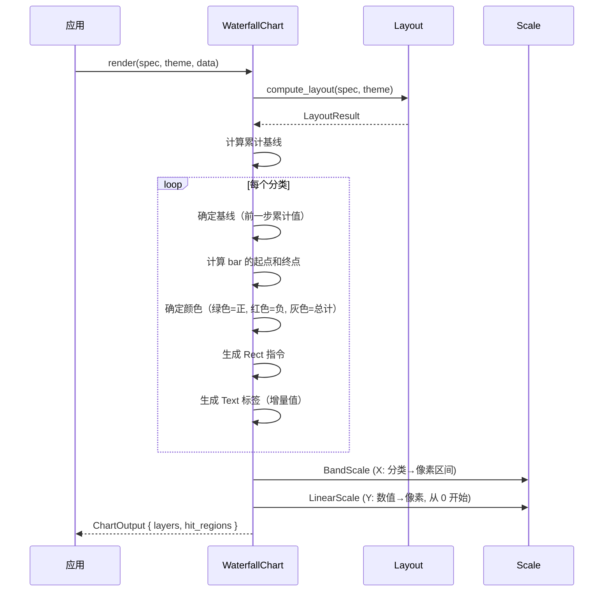

# 瀑布图 WaterfallChart

用彩色柱子表示增量变化，展示从起点到终点的累计过程。

## 基本用法

```rust
use deneb_component::{WaterfallChart, ChartSpec, Encoding, Field, Mark, DefaultTheme};
use deneb_core::parser::csv::parse_csv;

let table = parse_csv("category,change\nStart,0\nRev A,50\nRev B,-30\nRev C,45\nCosts,-25\nProfit,0")?;

let spec = ChartSpec::builder()
    .mark(Mark::Waterfall)
    .encoding(Encoding::new()
        .x(Field::nominal("category"))
        .y(Field::quantitative("change")))
    .width(800.0)
    .height(600.0)
    .build()?;

let output = WaterfallChart::render(&spec, &DefaultTheme, &table)?;
```

## 渲染流程



## 生成的绘图指令

| 指令 | 说明 |
|------|------|
| `Rect` (Data 层) | 柱子，绿色表示正值，红色表示负值 |
| `Text` (Data 层) | 标签（增量值） |
| `Path` (Grid 层) | 水平网格线 |
| `Path` (Axis 层) | 坐标轴线 + 刻度标记 |
| `Text` (Axis 层) | 分类标签（X）、数值标签（Y）、轴标题 |
| `Text` (Title 层) | 图表标题 |
| `Rect` (Background 层) | 背景填充 + 绘图区边框 |

## 瀑布图结构

每个柱子的基线是前一步的累计值：

```
  ↑ 100 ┤                          ┌───┐ (总计: Total)
        │                  ┌───┐   │ 40│
   ↑ 60 ┤              ┌───│ 45│   └───┘
        │          ┌───│ -30│   ┌──────┐
   ↑ 30 ┤      ┌───│ 50│───┘   │ Start│
        │  ┌───│ 0 │───┘       │  0   │
   ↑ 0  └──┴───┴──────────────┴──────┴──────→
        Start  RevA RevB  Costs  Profit  Total
```

**颜色编码**：
- **绿色**：正向增量
- **红色**：负向增量
- **灰色**：起点和总计（y=0）

## 比例尺

- **X 轴**：`BandScale`，分类映射到等宽区间
- **Y 轴**：`LinearScale`，数值映射到像素，范围从 0 开始，**必须从 0 开始**（柱状图变体）

## 特殊行为

| 场景 | 行为 |
|------|------|
| 空数据 | 仅返回 Background + Title 层 |
| 全正值 | 基线单调递增 |
| 全负值 | 基线单调递减 |
| 零值 | 无高度的 bar（但仍有位置） |
| 缺少必需字段 | 返回 `ComponentError` |

## 命中区域

每个柱子生成一个矩形 `HitRegion`，精确匹配柱子的像素范围（x, y, width, height）。
