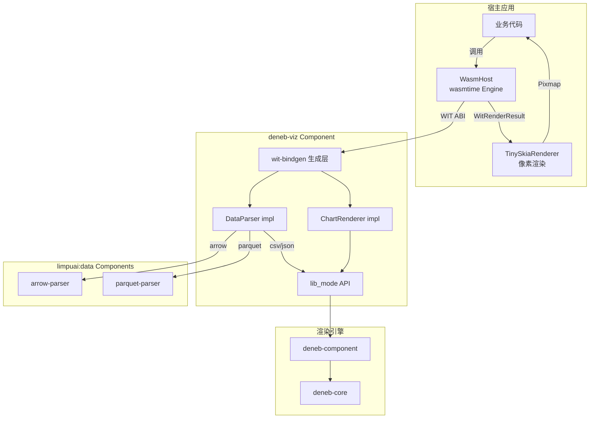
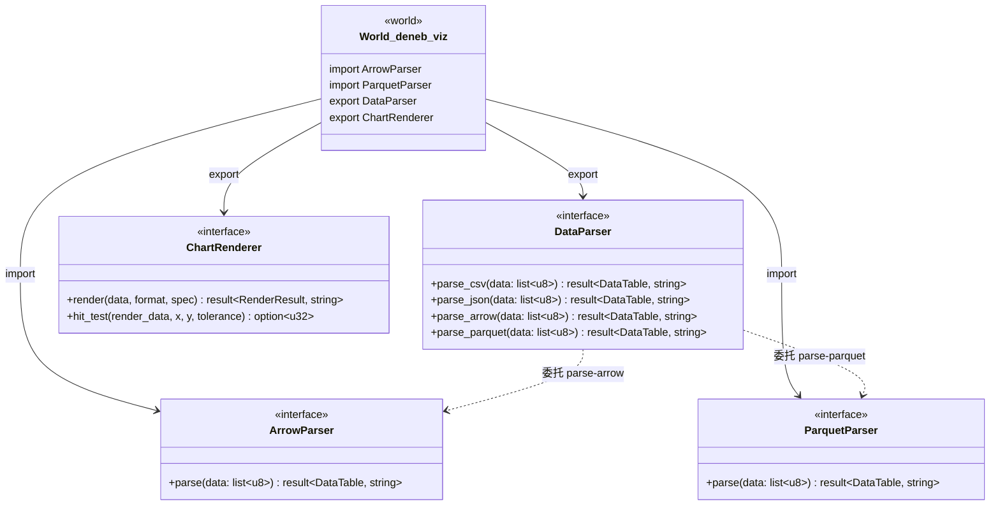
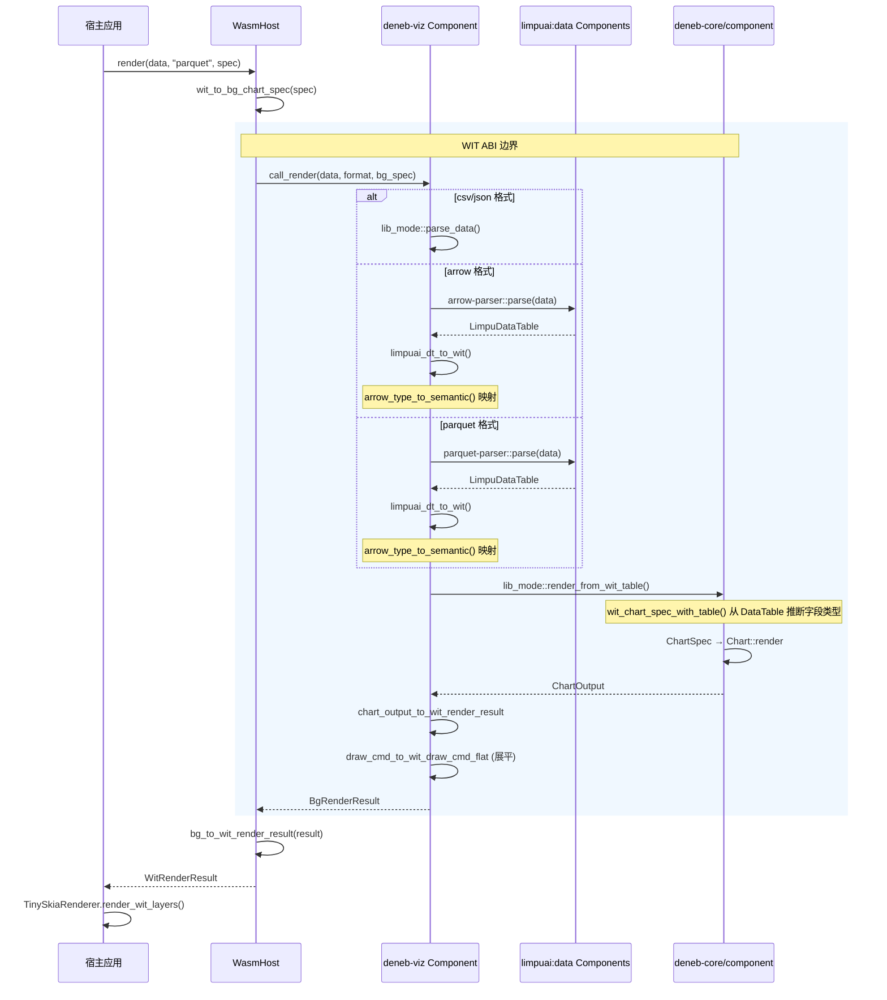
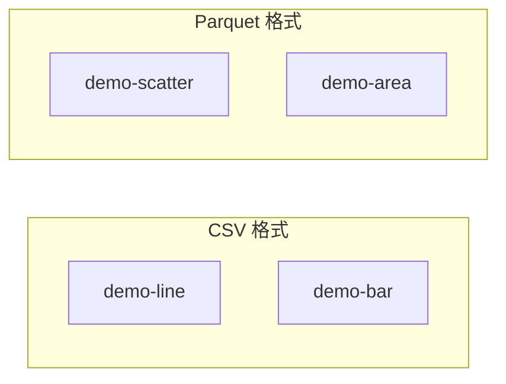

# WebAssembly 集成

deneb-rs 原生支持 WASI Component Model，可编译为标准 WASI 组件在任意支持 Component Model 的运行时中运行。

## 架构概览



## 编译

```bash
# 编译 WASI Component（release 模式）
cargo build -p deneb-wit-wasm --target wasm32-wasip2 --release
```

输出文件：`target/wasm32-wasip2/release/deneb_wit_wasm.wasm`（约 519KB）

编译产物是标准 WASI Component Model 格式，可直接被 wasmtime、Wasmtime Runtime 等支持 Component Model 的运行时加载。

### 编译目标

| 配置 | 值 |
|------|-----|
| Target | `wasm32-wasip2` |
| Crate type | `cdylib` |
| wit-bindgen | 0.57 |
| 启用的 features | `csv`, `json` |
| 外部 WIT 依赖 | `wit/deps/limpuai-data/` |

Arrow 和 Parquet 格式通过导入 `limpuai:data` 外部解析器组件实现支持，deneb-viz 在运行时动态链接这些组件。

## WIT 接口



## 宿主端使用

### 初始化

deneb-viz 通过 WIT `import` 声明依赖 `limpuai:data/arrow-parser` 和 `limpuai:data/parquet-parser`。宿主在实例化时需要将这些解析器组件链接到 deneb-viz：

```rust
use deneb_demo::wasm_host::{ParserPaths, WasmHost};

// 仅使用 csv/json 时（无需外部组件）
let mut host = WasmHost::from_file("deneb_wit_wasm.wasm")?;

// 需要 Arrow/Parquet 支持 — 指定解析器组件目录
let mut host = WasmHost::from_file_with_parsers(
    "deneb_wit_wasm.wasm",
    ParserPaths::from_dir("../limpuai-wit/target/wasm32-wasip2/release"),
)?;
```

`ParserPaths::from_dir` 按文件名约定自动发现 `limpuai_wit_arrow.wasm` 和 `limpuai_wit_parquet.wasm`。找到则链接，未找到则注册 stub。

### 数据解析

```rust
let table = host.parse_csv(b"x,y\n1,10\n2,20\n3,15")?;
let table = host.parse_parquet(&parquet_bytes)?;  // 需要 --deps 提供 parquet 解析器
```

### 图表渲染

```rust
use deneb_wit::wit_types::WitChartSpec;

let spec = WitChartSpec {
    mark: "line".to_string(),
    x_field: "x".to_string(),
    y_field: "y".to_string(),
    color_field: None,
    open_field: None,
    high_field: None,
    low_field: None,
    close_field: None,
    theta_field: None,
    size_field: None,
    width: 800.0,
    height: 600.0,
    title: Some("My Chart".to_string()),
    theme: None,
};

let result = host.render(csv_data, "csv", &spec)?;
```

`str_to_mark()` 函数支持所有 15 种图表类型：
- `"line"`, `"bar"`, `"scatter"`, `"area"`
- `"pie"`, `"histogram"`, `"boxplot"`, `"waterfall"`
- `"candlestick"`, `"radar"`, `"heatmap"`, `"strip"`
- `"sankey"`, `"chord"`, `"contour"`

### 像素渲染

```rust
use deneb_demo::TinySkiaRenderer;

let mut renderer = TinySkiaRenderer::new(800, 600)?;
renderer.render_wit_layers(&result.layers);
let pixmap = renderer.pixmap();
```

### 命中测试

```rust
let hit = host.hit_test(&result, 150.0, 200.0, 5.0)?;
if let Some(region_index) = hit {
    println!("Hit region: {}", region_index);
}
```

## 完整调用流程



## 类型编码

WIT 不支持递归类型和 Rust 复杂枚举。deneb-rs 通过编码策略实现无损转换：

### DrawCmd 编码

| 内部类型 | `cmd_type` | `params` 格式 |
|---------|-----------|--------------|
| `Rect` | `"rect"` | `[x, y, width, height]` |
| `Circle` | `"circle"` | `[cx, cy, radius]` |
| `Path` | `"path"` | 路径段编码（见下表） |
| `Text` | `"text"` | `[x, y, font_size, anchor, baseline]` |
| `Group` | 展平处理 | 子命令递归展平，`group_depth` 递增 |
| `Arc` | `"arc"` | `[cx, cy, r, start_angle, end_angle]` |

### Path 段编码

params 数组中按类型前缀拼接：

| 前缀 | 段类型 | 参数 |
|------|--------|------|
| `0` | MoveTo | x, y |
| `1` | LineTo | x, y |
| `2` | BezierTo | cp1x, cp1y, cp2x, cp2y, x, y |
| `3` | QuadraticTo | cpx, cpy, x, y |
| `4` | Arc | cx, cy, r, start, end, ccw |
| `5` | Close | — |

### Text 定位编码

| params 索引 | 含义 | 值映射 |
|------------|------|--------|
| `[2]` | font_size | 原始值 |
| `[3]` | anchor | 0=Start, 1=Middle, 2=End |
| `[4]` | baseline | 0=Top, 1=Middle, 2=Bottom, 3=Alphabetic |

### DataTable 转换

内部列式存储转换为 WIT 行式传输：

```
内部 Columnar:           WIT Row-based:
┌─────────────┐          ┌─────────────────┐
│ Column "x"  │          │ Row 0: [1, 10]  │
│ [1, 2, 3]   │   ──→    │ Row 1: [2, 20]  │
│ Column "y"  │          │ Row 2: [3, 15]  │
│ [10, 20, 15]│          └─────────────────┘
└─────────────┘
```

### Arrow 物理类型映射

limpuai:data 解析器返回 Arrow 物理类型名（`Int64`, `Float64`, `Utf8`），deneb-wit-wasm 通过 `arrow_type_to_semantic()` 映射为 deneb 语义类型：

| Arrow 物理类型 | deneb 语义类型 |
|---------------|---------------|
| `Int8`, `Int16`, `Int32`, `Int64`, `UInt8`–`UInt64`, `Float16`–`Float64`, `Decimal128/256` | `quantitative` |
| `Date32`, `Date64`, `Timestamp`, `Time32`, `Time64`, `Duration` | `temporal` |
| `Utf8`, `LargeUtf8`, `Binary`, `LargeBinary`, `Boolean` | `nominal` |

### 字段类型推断

`WitChartSpec` 只传字段名，不传类型。`wit_chart_spec_with_table()` 从 `DataTable` 的列类型推断 `Field` 编码：

| 列 DataType | Field 编码 |
|------------|-----------|
| `Nominal`, `Ordinal` | `Field::nominal()` |
| `Temporal` | `Field::temporal()` |
| `Quantitative` | `Field::quantitative()` |

## Demo 演示



```bash
# CSV 格式（无需 --deps）
cargo run --bin demo-line -- --wasm target/wasm32-wasip2/release/deneb_wit_wasm.wasm
cargo run --bin demo-bar -- --wasm target/wasm32-wasip2/release/deneb_wit_wasm.wasm

# Parquet 格式（需要 --deps）
cargo run --bin demo-scatter -- \
  --wasm target/wasm32-wasip2/release/deneb_wit_wasm.wasm \
  --deps ../limpuai-wit/target/wasm32-wasip2/release
cargo run --bin demo-area -- \
  --wasm target/wasm32-wasip2/release/deneb_wit_wasm.wasm \
  --deps ../limpuai-wit/target/wasm32-wasip2/release
```
