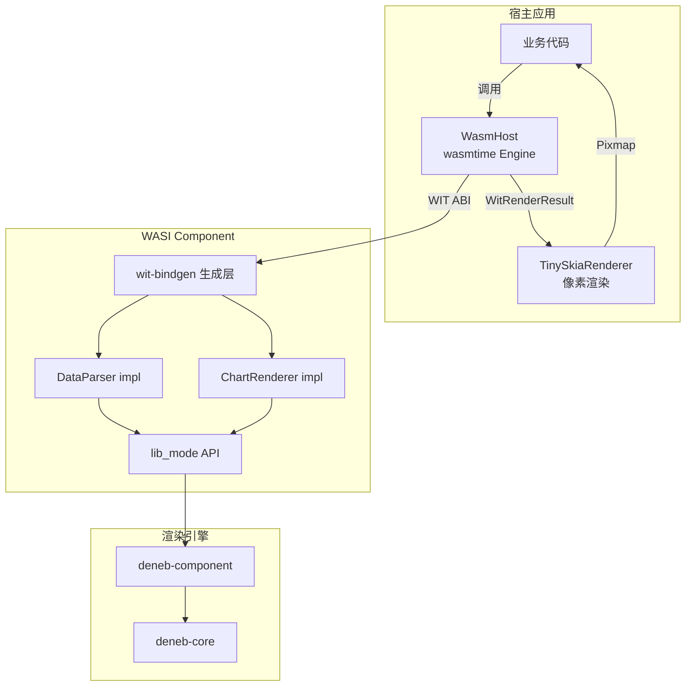
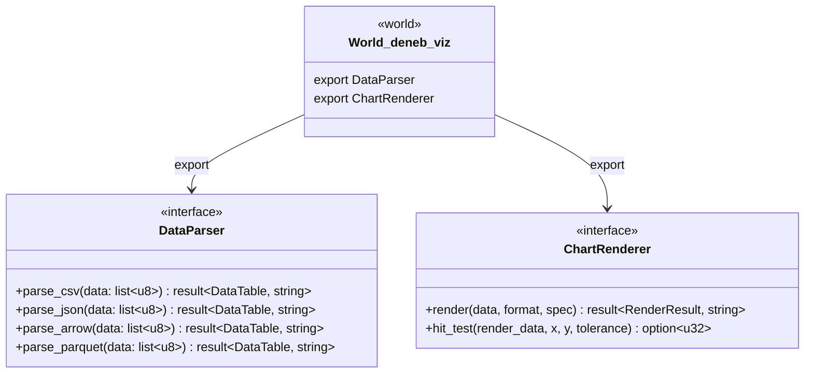
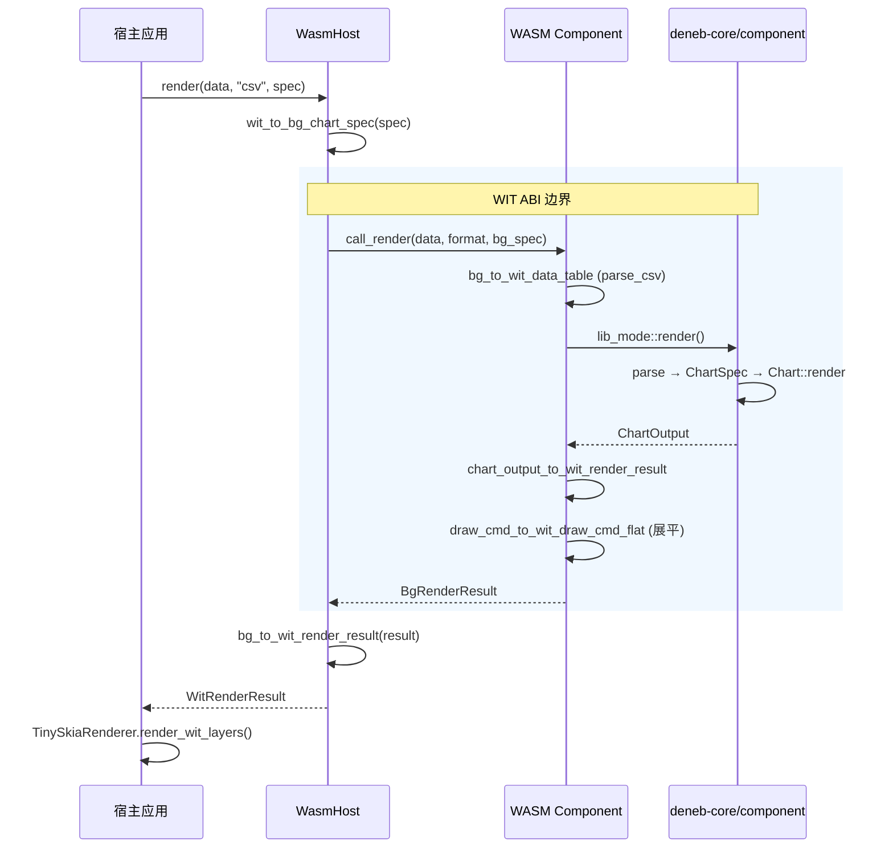

# WebAssembly 集成

deneb-rs 原生支持 WASI Component Model，可编译为标准 WASI 组件在任意支持 Component Model 的运行时中运行。

## 架构概览



## 编译

```bash
# 编译 WASI Component（release 模式）
cargo build -p deneb-wit-wasm --target wasm32-wasip2 --release
```

输出文件：`target/wasm32-wasip2/release/deneb_wit_wasm.wasm`（约 498KB）

编译产物是标准 WASI Component Model 格式，可直接被 wasmtime、Wasmtime Runtime 等支持 Component Model 的运行时加载。

### 编译目标

| 配置 | 值 |
|------|-----|
| Target | `wasm32-wasip2` |
| Crate type | `cdylib` |
| wit-bindgen | 0.51 |
| 启用的 features | `csv`, `json` |

Arrow 和 Parquet 格式在 WASM 中不可用，因为底层依赖不兼容 `wasm32` 目标。

## WIT 接口



## 宿主端使用

### 初始化

```rust
use deneb_demo::wasm_host::WasmHost;

let mut host = WasmHost::from_file("deneb_wit_wasm.wasm")?;
```

### 数据解析

```rust
let table = host.parse_csv(b"x,y\n1,10\n2,20\n3,15")?;
```

### 图表渲染

```rust
use deneb_wit::wit_types::WitChartSpec;

let spec = WitChartSpec {
    mark: "line".to_string(),
    x_field: "x".to_string(),
    y_field: "y".to_string(),
    color_field: None,
    width: 800.0,
    height: 600.0,
    title: Some("My Chart".to_string()),
    theme: None,
};

let result = host.render(csv_data, "csv", &spec)?;
```

### 像素渲染

```rust
use deneb_demo::TinySkiaRenderer;

let mut renderer = TinySkiaRenderer::new(800, 600)?;
renderer.render_wit_layers(&result.layers);
let pixmap = renderer.pixmap();
```

### 命中测试

```rust
let hit = host.hit_test(&result, 150.0, 200.0, 5.0)?;
if let Some(region_index) = hit {
    println!("Hit region: {}", region_index);
}
```

## 完整调用流程



## 类型编码

WIT 不支持递归类型和 Rust 复杂枚举。deneb-rs 通过编码策略实现无损转换：

### DrawCmd 编码

| 内部类型 | `cmd_type` | `params` 格式 |
|---------|-----------|--------------|
| `Rect` | `"rect"` | `[x, y, width, height]` |
| `Circle` | `"circle"` | `[cx, cy, radius]` |
| `Path` | `"path"` | 路径段编码（见下表） |
| `Text` | `"text"` | `[x, y, font_size, anchor, baseline]` |
| `Group` | 展平处理 | 子命令递归展平，`group_depth` 递增 |

### Path 段编码

params 数组中按类型前缀拼接：

| 前缀 | 段类型 | 参数 |
|------|--------|------|
| `0` | MoveTo | x, y |
| `1` | LineTo | x, y |
| `2` | BezierTo | cp1x, cp1y, cp2x, cp2y, x, y |
| `3` | QuadraticTo | cpx, cpy, x, y |
| `4` | Arc | cx, cy, r, start, end, ccw |
| `5` | Close | — |

### Text 定位编码

| params 索引 | 含义 | 值映射 |
|------------|------|--------|
| `[2]` | font_size | 原始值 |
| `[3]` | anchor | 0=Start, 1=Middle, 2=End |
| `[4]` | baseline | 0=Top, 1=Middle, 2=Bottom, 3=Alphabetic |

### DataTable 转换

内部列式存储转换为 WIT 行式传输：

```
内部 Columnar:           WIT Row-based:
┌─────────────┐          ┌─────────────────┐
│ Column "x"  │          │ Row 0: [1, 10]  │
│ [1, 2, 3]   │   ──→    │ Row 1: [2, 20]  │
│ Column "y"  │          │ Row 2: [3, 15]  │
│ [10, 20, 15]│          └─────────────────┘
└─────────────┘
```

## Demo 演示

四个 demo binary 都支持 `--wasm` 参数切换到 WASM 渲染路径：

```bash
# Native 渲染
cargo run --bin demo-line

# WASM 渲染
cargo run --bin demo-line -- --wasm target/wasm32-wasip2/release/deneb_wit_wasm.wasm

# 同样适用于其他图表
cargo run --bin demo-bar -- --wasm target/wasm32-wasip2/release/deneb_wit_wasm.wasm
cargo run --bin demo-scatter -- --wasm target/wasm32-wasip2/release/deneb_wit_wasm.wasm
cargo run --bin demo-area -- --wasm target/wasm32-wasip2/release/deneb_wit_wasm.wasm
```
